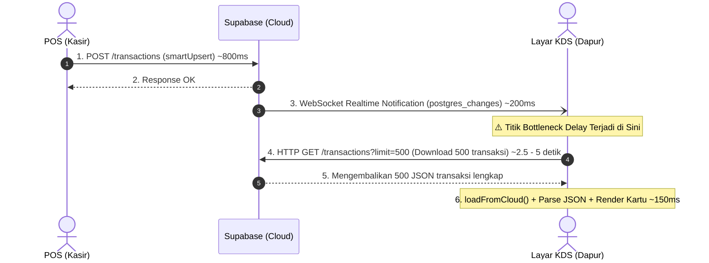
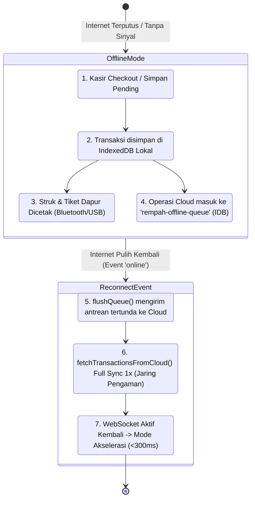

# 🔎 ANALYSE — Audit Alur Transaksi & Pergerakan Stok (v4.7)

> **Tujuan**: analisa ulang menyeluruh alur transaksi (checkout normal, pending payment, split bill, void/cancel, refund, demo) dan pergerakan stok (deduct, revert, reserve, delta pending, sesi split) untuk menemukan potensi bug & logic yang bermasalah yang belum tertangkap prioritas 1–17.
> **Metode**: pembacaan ulang kode `AtomicTransactionEngine`, `inventoryStore`, `transactionStore`, `SplitBillModal`, `splitStockSession`, `hpp.ts`, `refund.ts`, `transactionStockActions.ts`, `Transactions.tsx`, `cloudSync` (jalur stok).
> **Branch/versi**: `develop`, v4.7 — tsc 0 error, 460/460 test, build produksi sukses.
> **Status**: 🔎 **ANALISA — belum ada perubahan kode** (temuan siap dieksekusi bertahap; prioritas diusulkan per item).

---

## Ringkasan

| # | Temuan | Severity | Area | Perlu fix? |
|---|--------|----------|------|------------|
| A1 | `skipStockDeduction` tidak pernah dipakai caller (dead param) | 🟢 Rendah | Engine | Opsional (hapus/satukan dengan `reservedDeductions`) |
| A2 | `calculateItemDeductions`: flag `hasSnapshot` global → item tanpa snapshot ikut dibuang bila 1 item punya snapshot | 🟢 Rendah | hpp.ts | Defensif (per-item fallback) |
| A3 | Rollback engine mengembalikan stok via `updateItem(skipLog)` → jejak stock log 'deduct' tanpa 'add' balasan | 🟢 Rendah | Engine | Perbaiki audit trail stok |
| A4 | Race double-refund (klik ganda) → revert stok ganda + Kas Keluar ganda | 🟠 Sedang | Transactions | Guard in-flight/store-level |
| A5 | Race sync stok multi-device saat burst (cloud bisa berakhir stale lebih tinggi) | 🟠 Sedang | cloudSync/inventory | Risiko terdokumentasi (O-7); pertimbangkan `updated_at` inventory |
| A6 | `computeCartSignature` tidak menyertakan harga add-on & kuantitas → deteksi "cart sama" bisa salah (split session / pendingItemsChanged) | 🟠 Sedang | splitStockSession/POS | Perluas signature |
| A7 | Split dari pending: sub-bill dapat nomor antrean BARU per sub-bill (N nomor) — inkonsisten dgn split fresh (1 nomor) | 🟡 INFO | SplitBillModal | Keputusan desain / seragamkan |
| A8 | Pending split: delta-0 mengasumsikan item sub-bill == item parent — bila sub-bill bisa diedit, stok bocor | 🟡 INFO | SplitBillModal | Verifikasi/guard |
| A9 | Cancel parent pending yang beranak split tidak revert bagian belum lunas (harus void sub-bill satu per satu) | 🟡 INFO | transactionStore | Perilaku terdokumentasi — perlu SOP |
| A10 | Tiket dapur bisa hilang saat resume pending item tidak berubah + printer gagal saat Simpan Pending | 🟡 INFO | POS/printer | Mitigasi queue/retry sudah ada |
| A11 | `validateStockAvailability` & `deductStock` diam-diam melewati id bahan yang sudah dihapus dari inventory | 🟢 Rendah | inventoryEngine | Tambah warning |
| A12 | `lastNegativeStockAlerts` di-reset oleh revert apa pun (bukan hanya yang relevan) | 🟢 Rendah | inventoryStore | Kosmetik |
| A13 | Demo tidak punya jalur pembuatan — hanya transisi Selesai→Demo | 🟡 INFO | POS/Transactions | Perilaku (keputusan produk) |

---

## 🔴 A. Temuan yang layak diperbaiki

### A1 — `skipStockDeduction` dead param (Rendah)
- **Lokasi**: `src/types/index.ts` (±226), `src/lib/atomicTransactionEngine.ts` (±188).
- **Fakta**: engine menghandle `params.skipStockDeduction` (lewatkan potong stok), tapi **tidak ada caller yang mengirimnya** — SplitBillModal memakai `reservedDeductions` (delta 0) sebagai gantinya. Param mati ini menyesatkan: caller baru yang memakai `skipStockDeduction: true` akan melewati potong stok tanpa reserve → stok bocor diam-diam.
- **Usulan**: hapus param (atau beri deprecation + validasi: tidak boleh bersamaan dengan `reservedDeductions`).

### A2 — `calculateItemDeductions`: flag `hasSnapshot` global (Rendah/defensif)
- **Lokasi**: `src/utils/hpp.ts` (`calculateItemDeductions`).
- **Fakta**: jika **satu saja** item punya `recipeSnapshot` non-kosong → `hasSnapshot = true` → SEMUA item tanpa snapshot **tidak dihitung** (fallback legacy di-skip). Di praktik aman (engine selalu membuat snapshot utuh per transaksi; item dengan snapshot kosong memang tak punya bahan), tapi rapuh: campuran snapshot/legacy dalam satu transaksi akan kehilangan deduksi item legacy.
- **Usulan**: hitung **per item** — `ing = item.recipeSnapshot?.length ? item.recipeSnapshot : fallback menu/addon(item)`, tanpa flag global.

### A3 — Rollback engine tidak meninggalkan jejak 'add' di stock log (Rendah)
- **Lokasi**: `src/lib/atomicTransactionEngine.ts` `executeRollback`.
- **Fakta**: rollback me-restore stok via `updateItem(invId, { stock }, { skipLog: true })` → stok kembali tapi **stock log menunjukkan 'deduct' tanpa 'add' balasan** → jejak audit stok tidak seimbang untuk transaksi yang gagal (log "transaksi dipotong" padahal batal).
- **Usulan**: rollback memakai `revertStock(delta, 'Rollback transaksi gagal #...')` (log 'add' + sync bulk) atau tulis log koreksi eksplisit; `updateItem(skipLog)` hanya untuk kasus lain.

### A4 — Race double-refund (Sedang)
- **Lokasi**: `src/pages/Transactions.tsx` `executeRefund` + `src/utils/refund.ts`.
- **Fakta**: guard `isRefundableTransaction(tx, ...)` memakai **salinan tx dari render** (`refunded` belum ter-update di state komponen). Dua konfirmasi cepat (klik ganda / Enter+klik) bisa lolos keduanya → **revert stok ganda + 2× Kas Keluar Refund**. `updateTxMeta` lokal sinkron, tapi jendela antar dua klik bisa melewati keduanya.
- **Usulan**: (1) cek ulang `refunded` dari **store** di awal `executeRefund` (`transactions.find(t => t.id)?.refunded`), (2) disable tombol saat `refundPending`, (3) tombol Konfirmasi pakai state "processing". Test: simulasi double-call `executeRefund`.

### A5 — Race sync stok multi-device saat burst (Sedang, risiko terdokumentasi)
- **Lokasi**: `src/store/inventoryStore.ts` `deductStock`/`revertStock` → `syncInventoryStock` (`src/lib/cloudSync.ts`).
- **Fakta**: `syncInventoryStock` mengirim **nilai stok pasca-mutasi lokal** (`item.stock` saat itu). Dua device memotong bahan yang sama hampir bersamaan → urutan selesai network bisa tertukar → cloud bisa berakhir dengan nilai **lebih tinggi (stale)** sampai mutasi berikutnya; fetch berikutnya (loadFromCloud inventory) bisa menimpa lokal dengan nilai stale itu. O-7 mendeteksi konflik (banner kuning) tapi **tidak mengoreksi otomatis**.
- **Usulan**: pertimbangkan kolom `updated_at`/versi di tabel `inventory` + perbandingan saat sync (last-write-wins berbasis timestamp), atau normalisasi stok cloud dari stock log (Σ log) saat load. Minimal: dokumentasikan batasan & SOP cek stok pagi.
- ✅ **SELESAI (v4.7 TO DO 18.8/A5 — last-write-wins via updatedAt)**: kolom `updated_at` sudah ada di `CREATE TABLE inventory`; ditambah **Migration 29** (ALTER idempoten self-heal DB lama + flag `inventoryUpdatedAt`). `InventoryItem.updatedAt` dipakai `isLocalNewer()` (`src/utils/inventoryFreshness.ts`): (1) SEMUA mutasi stok (deduct/revert/updateItem/applyBulkStock/import/addItem) men-stamp `updatedAt`; (2) payload sync (`syncInventoryItem`, `syncInventoryStock`, fallback absolut `adjustInventoryStockCloud`) menyertakan `updated_at`; (3) `fetchInventoryFromCloud` memetakan `updated_at`; (4) `loadFromCloud` **last-write-wins per item** — mutasi lokal yang lebih baru TIDAK ditimpa fetch cloud stale (versi cloud yang kalah tidak di-merge → anti duplikat), cloud yang lebih baru diadopsi, legacy tanpa timestamp → cloud otoritatif (perilaku lama). Sisa risiko: online-atomic RPC (18.1) sudah menutup lost-update; jalur fallback absolut tetap last-write-wins by timestamp — **SOP: cek stok pagi** tetap disarankan. +15 test.

### A6 — `computeCartSignature` tidak menyertakan harga add-on / kuantitas (Sedang)
- **Lokasi**: `src/utils/splitStockSession.ts` (`computeCartSignature`), dipakai `releaseSplitReserveForCart` (POS sebelum checkout normal) & `pendingItemsChanged` (POS).
- **Fakta**: signature = `menuId:quantity:namaAddons:temp:sugar` — **harga add-on dan kuantitas tidak masuk**. Perubahan cart yang hanya mengubah harga add-on bisa dianggap "cart sama":
  - **Split session**: sesi tidak dilepas saat seharusnya dilepas → reserve lama tersisa + checkout normal memotong penuh → **double deduction** (skenario: bill 1 lunas 1× item, harga add-on berubah, lanjut checkout normal 2× item → terpotong 3×).
  - **pendingItemsChanged**: hanya memengaruhi default cetak/status dapur (dampak kecil).
- **Usulan**: perluas signature dengan `addons.map(a => a.name + ':' + a.price)` (+qty bila add-on punya qty). Tambah test `computeCartSignature` (harga berbeda → signature beda).

---

## 🟡 B. Risiko / edge yang perlu keputusan desain

### A7 — Split dari pending: sub-bill memakai nomor antrean BARU (N nomor)
- **Lokasi**: `src/components/SplitBillModal.tsx` — `overrideQueueNumber: !parentTx ? activeSession?.queueNumber || undefined : undefined`.
- **Fakta**: split **fresh** → semua sub-bill memakai **satu nomor** (kunci dari sub-bill pertama). Split **dari pending** → `overrideQueueNumber = undefined` → engine memanggil `getNextQueueNumber()` **per sub-bill** → N sub-bill mengonsumsi N nomor antrean baru, sementara parent pending sudah punya nomornya → counter melompat & struk sub-bill bernomor beda dari parent.
- **Usulan/keputusan**: seragamkan — sub-bill split pending juga memakai nomor parent (`overrideQueueNumber: parentTx?.queueNumber`), atau dokumentasikan bahwa N sub-bill = N nomor (bila memang disengaja).
- ✅ **KEPUTUSAN & SELESAI (v4.7 TO DO 18.8/A7)**: **seragamkan 1 pesanan = 1 nomor** — helper murni `resolveSplitQueueNumber(parentTx, session)`: split pending → nomor PARENT; split fresh → nomor sesi; dipakai di `overrideQueueNumber`. Bonus: `findDuplicateQueueNumbers` kini mengecualikan sub-bill split (`splitParentId`/`splitIndex`) — nomor bersama dalam satu pesanan tidak lagi salah terbaca sebagai "#N duplikat" (juga memperbaiki false-positive latent untuk split fresh). +5 test.

### A8 — Pending split: delta-0 mengasumsikan item sub-bill == item parent
- **Lokasi**: `SplitBillModal` → engine (`reservedDeductions: reservedForSubBill`).
- **Fakta**: stok parent sudah terpotong penuh saat Simpan Pending. Sub-bill memakai `reservedDeductions = deduksi sub-bill itu sendiri` → delta 0 → stok tidak disentuh. **Benar HANYA bila item sub-bill identik dengan item parent**. Bila alur pending-split memungkinkan edit item (tambah/kurangi), item baru tidak dipotong & item dihapus tidak dikembalikan → **stok bocor**.
- **Usulan**: verifikasi bahwa modal pending-split mengunci item = item parent (tidak bisa diedit); bila bisa diedit, sub-bill harus memakai delta terhadap reserved parent (`reservedDeductions = calculateItemDeductions(parent.items, menus)`).
- ✅ **KEPUTUSAN & SELESAI (v4.7 TO DO 18.8/A8)**: cart TIDAK dikunci (kasir boleh edit sebelum split) — sebagai gantinya **rekonsiliasi reserve SEKALI per parent** saat sub-bill pertama benar-benar dibayar (titik komit): helper murni `computePendingSplitReconcile(parentDeductions, currentDeductions)` menghitung delta (item dihapus → `revertStock`; item ditambah → `deductStock`) + toast info. Idempoten (selalu dari deduksi ORIGINAL parent) dan TIDAK double-adjust bila user batal split lalu finalize biasa (jalur finalize pending tetap pakai delta engine). +5 test.

### A9 — Cancel parent pending beranak split: bagian belum lunas tidak otomatis kembali
- **Lokasi**: `src/store/transactionStore.ts` `cancelPendingTransaction` (guard `hasPendingSplitChildren`).
- **Fakta**: guard mencegah double-revert (benar), tapi konsekuensinya stok bagian **belum lunas** hanya bisa kembali bila **setiap sub-bill Selesai di-void satu per satu**. Operator yang hanya membatalkan parent akan kehilangan stok bagian unpaid.
- **Usulan**: SOP/panduan (void sub-bill dulu), atau alur "Batalkan Parent + Semua Sub-bill Belum Lunas" sekali klik dengan revert gabungan yang aman.
- ✅ **KEPUTUSAN & SELESAI (v4.7 TO DO 18.8/A9)**: **SOP void satu per satu** — void parent beranak split / sub-bill memunculkan toast peringatan jelas di Transactions.tsx ("stok bagian belum lunas hanya kembali bila setiap sub-bill Selesai di-void satu per satu"). Alur sekali-klik dengan revert gabungan TIDAK dibuat (risiko double-revert & fabrikasi data) — dicatat sebagai batasan desain; SOP di-applyStockEffects + terdokumentasi.

### A10 — Tiket dapur bisa hilang saat resume pending item tidak berubah
- **Lokasi**: `POS.tsx` (default `skipKitchenPrint = !!currentPendingTx && !pendingItemsChanged`).
- **Fakta**: anti-tiket-dobel membuat tiket dapur **tidak dicetak ulang** saat finalize resume dengan item sama — benar **bila** tiket sudah keluar saat Simpan Pending. Tapi bila printer dapur **gagal/offline saat Simpan Pending** (dan retry queue juga gagal), tiket tidak pernah sampai dapur dan tidak dicetak ulang saat bayar.
- ✅ **SELESAI (v4.7 TO DO 18.8/A10)**: engine men-stamp **`kitchenTicketPrintedAt`** pada transaksi HANYA bila tiket dapur **benar-benar sukses** dicetak saat Simpan Pending (`didKitchenPrintSucceed` di `triggerPostCommitTasks`; printer gagal → tidak di-stamp). Resume memakai fakta itu via helper murni `shouldSkipKitchenPrintAtResume` (`src/utils/kitchenTicket.ts`): item berubah → cetak ulang; item sama & sudah cetak → skip (anti dobel); item sama & belum pernah cetak (printer gagal) → **cetak ulang** — tiket tidak hilang diam-diam. Kolom `kitchen_ticket_printed_at` + Migration 30 (self-heal DB lama) + mapping `syncTransaction`/`syncTransactionMeta` (lintas device). Split dari pending tetap tidak mencetak tiket (target 'cashier'). Test **566/566**.

---

## 🟢 C. Temuan kecil / kosmetik

- **A11** — `validateStockAvailability` & `deductStock` melewati id bahan yang sudah tidak ada di inventory (`if (!inv) continue` / `if (item && amount > 0)`): resep dengan id bahan yang sudah dihapus tidak memberi peringatan apa pun. Usulan: tambah warning "bahan {id} tidak ditemukan" di validasi.
  - ✅ **SELESAI (v4.7 TO DO 18.8/A11)**: `InventoryEngine.validateStockAvailability` kini melaporkan bahan yang direferensikan resep tapi **sudah dihapus** sebagai warning `missing: true` (`ingredientName` = id, `available: 0`) — checkout terblokir dengan peringatan (bisa "Lanjutkan Tetap", perilaku sama dengan stok kurang). Modal peringatan stok POS menampilkan pesan khusus "Bahan tidak ditemukan (ID: …) — resep memakai bahan ini tapi sudah dihapus dari Inventaris". +2 test (`stockCheck.test.ts`).
- **A12** — `revertStock` me-reset `lastNegativeStockAlerts` untuk revert apa pun (tidak hanya yang memperbaiki item negatif) → banner hilang lebih cepat. Kosmetik.
  - ✅ **SELESAI (v4.7 TO DO 18.8/A12)**: `revertStock` kini **memfilter** alert: item yang MASIH negatif pasca-revert dipertahankan (stok terbaru); alert hanya hilang bila revert benar-benar mengeluarkan item dari negatif. Revert item lain yang tidak relevan tidak lagi menghapus peringatan. +3 test (`stockNegativeAlert.test.ts`).
- **A13** — Demo tidak punya jalur **pembuatan** (hanya transisi status Selesai→Demo). Bila produk ingin tombol "Catat Transaksi Demo" dari POS, belum ada. Keputusan produk.
  - ✅ **SELESAI (v4.7 TO DO 18.8/A13 — keputusan produk: dibuat)**: tombol **"Catat sebagai Demo (tidak memotong stok)"** di modal checkout POS → `overrideTxStatus: 'Demo'` + `suppressAutoPrint`. Engine: demo **tidak memotong stok** (bukan penjualan nyata), **queueNumber = 0** (tidak konsumsi nomor antrean RPC; Demo dikecualikan hitungan/laporan), tidak mencetak struk/tiket dapur, tidak merekam kunjungan/promo/loyalty. Riwayat Transaksi menampilkan label **DEMO** (bukan #0) & bisa dicari "demo"; demo hasil konversi Selesai→Demo tetap memakai nomor aslinya. Bila demo diubah ke Selesai, `applyStatusStockEffects` men-deduct stok + merekam kunjungan (perilaku 8.1 yang sudah ada). +3 test (`demoTransaction.test.ts`).

---

## ✅ D. Yang sudah benar (hasil verifikasi audit ini)

- **Engine delta pending** — `reservedDeductions` memakai **recipeSnapshot tersimpan** (bukan menu saat ini) → delta tambah/kurang item konsisten walau resep berubah. `calculateItemDeductions` memakai snapshot bila ada; fallback legacy hanya untuk transaksi lama.
- **Split fresh** — stok dipotong **sekali** (sub-bill pertama sesi, reserve penuh), `accumulatePaidPortion` di-cap pada `reserved` (mode Equal tidak mengakumulasi berulang), sesi dibersihkan saat semua lunas / cart berubah; HPP equal diskala (Σ hpp sub-bill = HPP induk).
- **Split dari pending** — parent tetap menahan deduksi stok; sub-bill delta-0; saat semua lunas, parent di-mark Selesai tanpa potong ulang.
- **Status stock effects** (`transactionStockActions.ts`) — satu jalur untuk semua transisi: Selesai→Cancel/Demo (revert), Pending→Cancel/Demo (revert reserve), Cancel/Demo→Selesai (deduct, termasuk Demo→Selesai), Delete Selesai/Pending (revert), guard `isSplit` & `refunded` (anti double revert).
- **Refund** — `isRefundableTransaction` menolak sub-bill split / induk beranak split, double-refund, nominal 0; revert stok via snapshot; Kas Keluar 'Refund' akuntabel; tandai `refunded` + sync cloud.
- **Unifikasi validasi stok** (TO DO 2.5) — `checkStockAvailability` hanya alias `InventoryEngine.validateStockAvailability`; engine & split memakai satu sumber kebenaran.
- **Sync stok bulk** (TO DO 8.3) — `deductStock`/`revertStock` memakai `syncInventoryStock` yang hanya mengirim **nilai pasca-mutasi** (tidak mengurangi lagi → tidak ada double deduction cloud); `applyBulkStock`/`importItems` batch 1 request.
- **17.3** — identitas pending persist (`resumeContext`) → tidak ada transaksi duplikat setelah pindah halaman/refresh; identity dibersihkan pasca-finalize.
- **Anti-duplikat transaksi cloud** — freshness compare (`updatedAt` fallback `date`) + eksklusi versi kalah (Prioritas 16).

---

## 🧩 E. SKENARIO 2 KASIR BERSAMAAN (termasuk mode offline)

> **Pertanyaan analisa**: bila 2 kasir login & bertransaksi bersamaan (masing-masing di device sendiri), masalah transaksi apa yang bisa muncul — nomor antrian, KDS, stok, laporan? Berlaku juga saat keduanya offline.
> **Kesimpulan utama**: sebagian besar aman karena sinkronisasi by-ID + realtime (KDS, laporan), tetapi ada **4 titik rawan nyata**: (E1) nomor antrean duplikat, (E2) lost-update stok, (E3) shift & expected cash, (E4) reserve split per-device. Semua memburuk saat offline.

### E1 — Nomor antrean DUPLIKAT (🟠 Tinggi; offline: 🔴 lebih parah)
- **Lokasi**: `src/store/transactionStore.ts` `getNextQueueNumber` (±70–125) + `loadFromCloud` (normalisasi `nextQueueNumber`).
- **Fakta**: nomor antrean dihitung **check-then-act** — fetch `max(queue_number)` dari cloud → `max(cloudMax, localMax) + 1`. Dua kasir yang memproses di saat bersamaan **bisa membaca cloudMax yang sama** lalu keduanya mendapat nomor yang sama → **dua transaksi berlabel #N kembar**. Tidak ada penguncian/lock/sequence atomik (mis. `nextval()` atau alokasi range per device). `loadFromCloud` hanya menormalkan **penghitung berikutnya** dari data hasil merge — label duplikat yang **sudah terlanjur dibuat tetap kembar** (tidak di-renumber).
- **Offline**: tidak ada fetch cloud → keduanya memakai `localMax + 1` dari baseline yang sama → **duplikat hampir pasti** setelah keduanya online & merge (dibatasi dokumentasi TO DO 13.6).
- **Dampak**: struk/kuitansi nomor kembar, laporan shift & KDS membingungkan (2 order #N), pelanggan komplain nomor antrean.
- **Usulan**: (1) alokasi **range per device** (mis. device id → offset 1000), (2) atau simpan counter terakhir di tabel cloud + **insert dengan verifikasi & retry** (bila nomor sudah dipakai → naikkan), (3) atau renumber ringan saat deteksi duplikat pasca-merge (dengan audit log). Minimal: tambah badge "#N (duplikat)" agar tidak membingungkan.

### E2 — Stok: LOST-UPDATE validate-then-deduct (🔴 Tinggi; offline: 🔴 parah)
- **Lokasi**: `AtomicTransactionEngine.executeCheckout` (validasi → `deductStock`), `inventoryStore.deductStock`.
- **Fakta**: validasi stok dan pemotongan adalah **dua langkah terpisah tanpa atomisitas lintas device**. Dua kasir melihat stok bahan = 5; keduanya lolos validasi; keduanya memotong 5 → **terpakai 10 dari 5**. Lokal masing-masing = 0, cloud = nilai yang menulis terakhir (0) → **stok sebenarnya −5, tampil 0** → selisih 5 unit **hilang tanpa terdeteksi** (alert negatif tidak muncul karena tidak ada device yang lokalnya negatif). O-7 mendeteksi konflik hanya saat nilai cloud > lokal (bukan kasus ini).
- **Offline**: baseline stok terakhir sama → **lost-update hampir pasti** untuk bahan yang laris; drift menumpuk sampai Stock Opname.
- **Usulan**: (1) deduksi dengan **optimistic concurrency** — `UPDATE ... SET stock = stock - X WHERE id = ... AND stock >= X` + retry/peringatan bila gagal (Supabase RPC/`update` dengan filter), (2) atau deduksi via **satu RPC atomik** yang juga mengembalikan stok aktual, (3) minimal: setelah commit, bandingkan stok hasil vs ekspektasi & catat selisih ke stock log (jejak audit), (4) dokumentasikan SOP "cek stok sebelum shift" untuk mode offline.

### E3 — Shift & Expected Cash: perangkat-perangkat (🟠 Sedang; offline: 🔴)
- **Lokasi**: `src/store/shiftStore.ts` — `activeShift` **tunggal global** per store/device, `openShift` **tanpa guard** (kasir kedua menimpa `activeShift` device-nya), `closeShift` menerima `totalSales`/`expectedCash` dari **komputasi lokal** device.
- **Fakta**: kasir A buka shift di device A, kasir B buka shift di device B → dua shift berbeda, masing-masing device hanya tahu shift-nya sendiri. **Expected cash saat tutup shift dihitung dari transaksi LOKAL device itu saja** → bila laci fisik dipakai bersama, selisih kas (cash difference) **salah** (kurang transaksi device lain). Riwayat shift lintas device tersedia (`loadFromCloud`), tapi **active shift tidak dibagikan** — laporan Shift Manager bisa menampilkan 2 shift "aktif" (dari 2 device) seperti kasus yang pernah Anda laporkan.
- **Offline**: expected cash makin tidak akurat (hanya transaksi lokal + queue offline belum ter-flush).
- **Usulan**: (1) pilih **1 shift aktif per outlet** (bukan per device) — tentukan prioritas (mis. shift pertama yang dibuka) atau kunci per kombinasi tanggal+device; (2) expected cash tutup shift dihitung dari **semua transaksi Selesai yang tersinkron** (query cloud) bukan hanya lokal, dengan peringatan bila masih ada queue belum sync; (3) peringatan bila tutup shift saat masih ada "N belum sinkron" (badge O-5 sudah ada — tautkan ke alur tutup shift).

### E4 — Reserve stok SPLIT hanya diketahui device pembuatnya (🟠 Sedang)
- **Lokasi**: `src/utils/splitStockSession.ts` — sesi reserve disimpan **localStorage per device** (`rempah-split-stock-session`).
- **Fakta**: kasir A memulai split (stok item di-reserve penuh di device A). Kasir B di device lain **tidak tahu** reserve itu → bisa menjual item yang sama → stok terpakai melebihi fisik (bagian dari kelas E2). Sesi split juga tidak bisa di-resume dari device lain.
- **Offline**: sama (reserve tidak pernah dibagikan).
- **Usulan**: dokumentasikan batasan (split = sesi di satu device) + warning di UI split "stok ini di-reserve hanya di device ini"; jangka panjang: simpan reserve sebagai transaksi status Pending/split-reserve di cloud.

### E5 — KDS / Dapur (🟢 Aman, catatan kecil)
- **Fakta**: `updateKitchenStatus` sync ke cloud + realtime → kedua device KDS melihat status sama. Split filter (`splitParentId`/`splitIndex`, Prioritas 5.10) konsisten lintas device. Tiket dapur dicetak di **printer masing-masing device** (tidak ada tiket ganda dari 2 kasir karena printer terpisah).
- **Catatan offline**: perubahan status dapur saat offline masuk offline queue (O-10 urutan kronologis) → ter-flush saat online ✓. Alarm KDS (5 menit) & mute bersifat per-device (kosmetik).
- **Satu catatan**: dua kasir membuka KDS bersamaan tidak saling mengunci (tidak ada masalah — status last-write-wins).

### E6 — Laporan & Akuntansi (🟢 Aman setelah sync, catatan transisi)
- **Fakta**: `loadFromCloud` merge **by ID** + freshness compare (Prioritas 16) → **tidak ada transaksi ganda** di laporan; dashboard/PPN/shift report menghitung dari daftar transaksi hasil merge. Split sub-bill sudah dieksklusi dari double accounting (`splitParentId`, Prioritas 1.6/5.2). Rekap Kas memakai `cashierId` → Kas Masuk/Keluar per kasir akurat.
- **Catatan transisi**: sebelum sync, **laporan lokal dua device berbeda** (normal — masing-masing baru tahu datanya sendiri); setelah keduanya online, realtime menyamakan. Offline: laporan device A tidak memuat penjualan device B sampai sync — bila Manager melihat laporan dari device yang belum sync, angkanya belum final.
- **Usulan kecil**: beri indikator "laporan belum final — N transaksi belum sinkron" di header laporan saat ada queue (reuse badge O-5).

### E7 — Promo usage & Loyalty (🟢/🟠 minor)
- `incrementUsage(promoId, customerId)` & `recordVisit`/poin loyalty **tanpa guard race** → dua kasir memakai voucher yang sama hampir bersamaan bisa **double-increment** (usage limit per pelanggan terlewati). Dampak kecil (nominal promo), tapi untuk voucher berbatas 1× per orang bisa lolos 2×.
- ✅ **SELESAI (v4.7 TO DO 18.8/E7)**: (1) **`reservePromoUsage(id, customerId, usageKey)`** di promoStore — cek batas (global & per pelanggan) dari **STORE saat commit** (bukan salinan render) + naikkan **atomik** dalam satu functional `set` (dua panggilan berurutan di device sama tidak bisa lolos ganda) + **ledger `usageKeys` id unik transaksi** → replay/re-commit transaksi yang sama (idempotentReplay) TIDAK menaikkan usage dua kali (sebelumnya `incrementUsage` jalan lagi saat replay → voucher berbatas 1× bisa terpakai 2×). (2) **Replay guard efek samping** di POS finalize: `recordVisit`/`deductLoyaltyPoints` (dan usage promo) kini hanya jalan bila `!result.idempotentReplay` — sebelumnya replay double-click mencatat **kunjungan ganda + poin loyalty terpotong 2×**. (3) **Merge ledger lintas device**: `loadFromCloud` menggabungkan `usageKeys` UNION (monotonik — key yang tercatat di mana pun adalah pemakaian nyata), bukan ditimpa last-write-wins. POS & SplitBillModal memakai `reservePromoUsage(subTx.id)` + toast peringatan bila batas tercapai (transaksi tetap diproses). **Residual terdokumentasi**: dua device OFFLINE memakai voucher sama hampir bersamaan tetap bisa lolos batas (sync promo LWW per record) — proteksi penuh lintas device butuh RPC counter (pola 18.2); kunjungan/loyalty lintas device juga LWW.

---

### 🎯 Prioritas eksekusi yang disarankan (A + E)
1. **E2** (lost-update stok) — paling berdampak operasional; mulai dari optimistic-concurrency / RPC atomik.
2. **E1** (nomor antrean duplikat) — alokasi range per device atau verifikasi+retry saat insert.
3. **E3** (shift & expected cash) — 1 shift aktif per outlet + expected cash dari data tersinkron.
4. **A4** (double-refund), **A6** (signature cart), **E4** (reserve split per-device → dokumentasi/UI warning).
5. **A7/A8/A9/A10** (konsistensi split pending & tiket) → **A1–A3** (pembersihan) → **E7** (promo race) ✅ SELESAI.

## 🏬 F. MULTI OUTLET / CABANG — Analisa Kesiapan (v4.7, belum dieksekusi)

> Analisa statis untuk menjawab: **"apa saja yang harus dipersiapkan agar fitur Multi Outlet / Cabang bisa diterapkan?"** — tanpa perubahan kode. Rincian eksekusi: **Prioritas 19 di `TO DO.md`**.

### F.0 — Kondisi saat ini (single outlet implisit `'default'`)

- **Semua tabel bisnis GLOBAL tanpa `outlet_id`**: `transactions`, `inventory`, `menus`, `menu_components`, `customers`, `promos`, `shifts`, `stock_logs`, `stock_opnames`, `cash_movements`, `audit_logs`. Satu-satunya pengecualian: `queue_counters.outlet_id` (sudah ada, default `'default'`) — fondasi nomor antrean per outlet sudah benar di level DB.
- **`Transaction.outletId?: string`** sudah ada di tipe (`src/types/index.ts:175`, komentar "Multi-outlet enterprise extension") tapi **belum pernah diisi/dipakai** — hanya placeholder.
- **Settings single row** (`settings.id = 1`): `store_name`, `address`, `receipt_header/footer`, `tax_enabled/percent`, `categories`, `printer_*`, `kitchen_printers`, `table_features`, dll — **global untuk semua cabang**; struk & pajak tidak bisa berbeda per cabang.
- **Users tanpa outlet**: role hanya `Manager | Kasir | Acaraki | Staf Gudang` (tidak ada `Owner`); seorang user tidak terikat ke cabang mana pun.
- **RLS semua tabel "Allow all for anon"** (`supabase/schema.sql` baris 428–439, 486, 612) — tidak ada scoping antar cabang sama sekali.
- **`allocateQueueNumberCloud` hardcode `p_outlet: 'default'`** (`src/lib/cloudSync.ts:737`) — RPC `allocate_queue_number` sudah menerima `p_outlet`, tinggal dikirim id outlet asli.
- **Realtime global** (`postgres_changes` tanpa filter) & **semua `fetch*FromCloud` tanpa filter** — setiap device menarik SEMUA data cloud semua cabang.
- **Shift** sudah ber-model "1 shift aktif per outlet" (18.3) tapi outlet-nya implisit `'default'`.
- **Backup/Restore** mem-backup seluruh DB (manifest + checksum) — tidak mengenal cabang.

### F.1 — Keputusan produk yang HARUS diambil dulu (menentukan seluruh desain)

1. **Model master data**: (a) **independen per cabang** (tiap cabang punya menu/inventaris/resep/promo/pelanggan sendiri — paling sederhana, cocok untuk waralaba dengan menu berbeda), (b) **pusat→cabang** (katalog didorong dari pusat, cabang hanya punya stok — butuh mekanisme push/sync master + versi), atau (c) **hibrida** (menu sama, stok & harga per cabang). **Rekomendasi awal: (a) independen** untuk MVP multi-outlet — paling sedikit perubahan pada engine/resep/validasi stok yang sudah solid.
2. **Akses pengguna**: user terikat **1 cabang** (Kasir/Staf Gudang/Dapur) vs **lintas cabang** (Manager/Owner bisa pindah cabang). Perlu menambah role **Owner** (saat ini tidak ada) sebagai super-admin multi-cabang.
3. **Identitas outlet**: id stabil (UUID/TEXT), nama, alamat, dan **settings per outlet** (nama toko di struk, alamat, footer, pajak, kategori, printer — tiap cabang beda hardware printer & pajak daerah).
4. **Nomor antrean**: sudah per-outlet di DB — keputusan: nomor restart tiap hari per cabang (perilaku sekarang, tinggal plumb `outlet_id` asli) atau lanjut global.
5. **Loyalty/promo lintas cabang**: poin & batas pemakaian per pelanggan — shared antar cabang (pelanggan sama di semua cabang) vs per cabang.

### F.2 — Checklist persiapan teknis (berurutan)

**Fase 1 — Fondasi data (migrasi, satu arah):**
- [ ] Kolom `outlet_id` di SEMUA tabel bisnis + **backfill idempoten** ke `'default'` (outlet pertama) — pola Migration 27–30 (probe + ALTER/UPDATE + console warning).
- [ ] `settings` jadi per-outlet (row per `outlet_id` atau ganti PK) — migrasi nilai row 1 → outlet `'default'`.
- [ ] `users.outlet_id` (atau tabel `users_outlets` untuk multi-assignment) + tambah role `Owner` pada CHECK.
- [ ] **RLS per-outlet** menggantikan "Allow all for anon": helper `current_outlet_id()` (dari JWT claim / header) + policy `USING (outlet_id = current_outlet_id())` per tabel — termasuk `settings`, `queue_counters`, `stock_logs`, `audit_logs`.

**Fase 2 — Aplikasi (sync & alur inti):**
- [ ] `currentOutlet` di auth store: pilih cabang saat login; **switch outlet** untuk Manager/Owner; guard halaman per cabang.
- [ ] Semua `fetch*FromCloud` + realtime + offline queue payload + `loadFromCloud` di-scope `outlet_id` (queue ops membawa `outlet_id`; tombstone & freshness compare per outlet).
- [ ] `allocateQueueNumberCloud` kirim `outlet_id` asli (hapus hardcode `'default'`); guard shift 1-per-outlet memakai id asli; engine stamp `Transaction.outletId`.
- [ ] Laporan (Penjualan/PPN/Promo/Refund/Shift/Kas) & Dashboard **filter per outlet**; struk termal & digital memakai `store_name`/alamat **per cabang**; label nama cabang di header.
- [ ] Settings halaman: pilih cabang yang sedang dikonfigurasi (Manager) — pajak, kategori, printer, tabel, struk per cabang.
- [ ] Backup/Restore: manifest menyimpan `outlet_id`; **restore per cabang** (tidak menimpa cabang lain); auto backup per cabang.

**Fase 3 — Lanjutan (nilai enterprise):**
- [ ] **Transfer stok antar cabang** (stock transfer + log khusus) — kebutuhan nyata multi-outlet.
- [ ] **Laporan konsolidasi** multi-cabang untuk Owner (gabungan vs per cabang).
- [ ] Master data push pusat→cabang (bila memilih model (b)/(c)); pelanggan & loyalty lintas cabang (bila shared).
- [ ] Permission granular per outlet per role (Kasir cabang A tidak melihat cabang B).

### F.3 — Yang SUDAH siap / memudahkan

- `queue_counters.outlet_id` + RPC `allocate_queue_number(p_outlet)` — fondasi antrean per cabang **sudah ada**.
- Konsep "1 shift aktif per outlet" & `computeShiftStats` (18.3) — tinggal plumb id outlet.
- `Transaction.outletId` placeholder — tinggal diisi engine.
- Offline queue, tombstone, freshness compare (`updatedAt`), RPC atomik, backup manifest — semua **bisa di-scope per outlet** tanpa mengubah mekanisme.
- Arsitektur local-first + sync cloud (bukan SQL langsung) — penambahan kolom filter relatif aman.

### F.4 — Risiko & catatan

- **RLS per-outlet adalah titik paling sensitif**: salah policy = kebocoran data cabang lain ATAU data hilang dari pandangan (fallback anon harus tetap jalan untuk device lama). Saran: ship RLS per-outlet **setelah** semua store konsisten menyertakan `outlet_id` di tiap payload.
- **Dua cabang di device yang sama**: tidak didukung (satu device = satu outlet aktif) — perlu keputusan; solusi sederhana: logout/login pindah cabang.
- **Realtime per cabang**: subscribe dengan filter `outlet_id=eq.<id>` (bukan global) untuk hemat bandwidth & privasi.
- **KDS/dapur per cabang**: printer & antrean tiket sudah per-device; tinggal pastikan tiket hanya keluar di printer cabang yang sama.
- **Estimasi dampak**: ~25–35 file tersentuh (types, schema, cloudSync, auth, semua store filter, layout/login, settings, laporan, backup) + ~15–20 test baru. Rekomendasi: kerjakan **bertahap** (Fase 1 → 2 → 3) dengan satu migration besar di awal.

### F.5 — Deep dive 19.13: sinkronisasi katalog PUSAT → CABANG (reuse infra sync yang ada)

> Analisa mendalam untuk model **pusat→cabang** (master data didorong dari pusat). Bertujuan menjawab: *"bagaimana infrastruktur sync yang sudah ada bisa dipakai tanpa konflik?"*

**F.5.1 — Data master yang di-push** (katalog): `menus` (nama, kategori, harga, bestseller, `ingredients`, `available_addons`, `manual_hpp`, `kitchen_target`, flag gula/suhu, `is_bundle`), `menu_components` (struktur bundle/add-on), **definisi bahan** di `inventory` (nama, unit, `cost_per_unit` — TAPI `stock` & `min_stock` tetap lokal per cabang), dan `categories` (settings).

**F.5.2 — Infrastruktur yang SUDAH ADA & bisa dipakai ulang:**

| Kebutuhan push | Infra yang ada | Catatan |
|---|---|---|
| Tulis katalog dari pusat | `syncMenu` → `smartUpsert('menus')` + `bundleRepository.syncComponentToCloud` + offline queue + retry | Reuse penuh — pusat adalah satu penulis |
| Cabang terima realtime | `subscribeToMenuComponents` + subscription global (posgres_changes) | Tinggal tambah filter `outlet_id=eq.<id>` (Fase 2) |
| Cabang offline saat push | `fetchMenusFromCloud` + `loadFromCloud` saat reconnect | Perlu **watermark** (lihat F.5.3-4) |
| Merge tanpa konflik stok | LWW `updated_at` inventory (A5/Migration 29) | `stock` TIDAK ikut di-push — kolom per cabang |
| Penonaktifan menu | `is_available` + tombstone `deletedLocalIds` (O-8) | Soft-delete lebih aman daripada DELETE (CASCADE resep) |
| Backup katalog | manifest backup (7.x) `MASTER_DATA` | Tambah scope `outlet_id` (19.10) |

**F.5.3 — Masalah inti & solusinya:**

1. **Referensi antar-tabel (masalah TERBESAR)**: `menu_components.child_id`, `menus.ingredients`, `available_addons` mereferensikan id menu/bahan. Bila cabang memakai id lokal sendiri (random/UUID), resep pusat yang mereferensikan **id pusat tidak cocok** → resep rusak, HPP salah, stok tidak terpotong. **Solusi: id master data dibuat DETERMINISTIK oleh pusat** (satu id yang sama di semua cabang; cabang hanya menerima, tidak menciptakan). Ini menghilangkan kebutuhan mapping id per cabang.
2. **Dua lapis inventory**: `name`/`unit`/`cost_per_unit` = definisi (master pusat); `stock`/`min_stock` = kondisi lokal per cabang. Push katalog **tidak menyentuh `stock`** → konflik stok antar device cabang yang sama tetap ditangani A5 LWW (sudah ada).
3. **Konflik tulis (satu arah vs dua arah)**:
   - **Opsi A — catalog READ-ONLY di cabang (rekomendasi MVP)**: cabang tidak bisa edit nama/harga/resep/bahan — hanya `stock`, `min_stock`, dan `is_available` (buka/tutup jual) yang lokal. Hanya 1 penulis (pusat) → LWW aman **by construction**, tidak ada konflik sama sekali. UI Edit Menu di cabang men-disable field master + label "Dikelola pusat".
   - **Opsi B — override per-field (lanjutan, bila cabang butuh harga/menu beda)**: kolom `source` ('center'/'branch') + `branch_override` + `updated_at`; merge rule: field yang di-override cabang & lebih baru → cabang menang (tandai untuk review pusat); selain itu pusat menang. Butuh UI deteksi konflik + resolusi manual.
4. **Watermark pull (hemat bandwidth & anti-timpa)**: `menus` & `menu_components` **belum punya `updated_at`** — tambah (pola A5). Cabang yang offline saat push → saat reconnect `fetch` hanya `WHERE updated_at > last_catalog_sync` + merge; stok lokal tidak ikut tertimpa karena kolom terpisah.
5. **Bulk push / event storm**: push 100 menu = 100 realtime event per cabang. Skala kecil OK; skala besar → **RPC `push_catalog_batch`** atau pull-based watermark (rekomendasi: pull-based lebih aman untuk bulk).
6. **Penghapusan**: `DELETE` menu pusat → `menu_components` ON DELETE CASCADE → resep hilang permanen. **Rekomendasi: soft-disable** (`is_available=false` + tombstone O-8 untuk cabang offline); DELETE nyata hanya lewat jalur khusus/backup.

**F.5.4 — Alur yang diusulkan (semua memakai infra yang ada):**

1. **Pusat ubah menu** → `smartUpsert('menus', {... source:'center', updated_at})` + komponen via `bundleRepository` (persis jalur `syncMenu` sekarang, + kolom baru).
2. **Cabang online** → realtime event → `loadFromCloud` merge (pola A5 LWW: `updated_at` pusat lebih baru → adopsi; `stock`/`is_available` lokal dipertahankan karena merge field-wise / kolom terpisah).
3. **Cabang offline saat push** → tidak terima realtime → saat reconnect: `fetchMenusFromCloud(watermark)` → merge → toast "Katalog diperbarui dari pusat (N menu)".
4. **Stok cabang** → tidak tersentuh push → antar device cabang yang sama tetap A5 LWW (sudah ada).

**F.5.5 — Perubahan yang dibutuhkan (untuk nanti di TO DO):**
- `menus` + `outlet_id`, `source`, `updated_at` (+ opsional `branch_override`); `menu_components` + `outlet_id`, `updated_at`; `inventory` + `outlet_id`, `source`.
- RLS per outlet (19.4) menutup akses antar cabang; settings per outlet (19.2) untuk kategori per cabang.
- Guard UI read-only di cabang (Opsi A) — field master disabled.
- Estimasi: +3 kolom per tabel, ~10–15 file (types, schema, cloudSync watermark, menuStore merge, Catalog guard, Layout/backup), ~10 test (merge catalog, watermark pull, read-only guard, push batch).

**F.5.6 — Trade-off & rekomendasi:**
- **MVP: Opsi A (read-only catalog, id deterministik dari pusat, definisi bahan shared + stok lokal)** — konflik = nol, reuse penuh infra sync yang ada, paling cepat ship.
- **Upgrade path: Opsi B** (override per-field) bila kebutuhan nyata muncul (cabang beda harga/menu) — butuh kolom `source` + merge rule + UI konflik.
- Keputusan penting yang belum diambil: apakah **harga bahan** (`cost_per_unit`) di-push (HPP sama semua cabang) atau per cabang (HPP beda per daerah — rekomendasi: per cabang, karena biaya bahan berbeda-beda).

### F.6 — Deep dive 19.13g: skema ID DETERMINISTIK untuk master data pusat→cabang

> Analisa mendalam: *"bagaimana meng-generate id menu/bahan yang stabil & unik global tanpa collision antar cabang yang offline?"*

**F.6.1 — Kondisi saat ini**: `menus` & `inventory` memakai **UUID v4 acak yang dibuat lokal** (`Catalog.tsx:175` `editId || uuid()`, `inventoryStore.ts:36/109/143/200` `id: uuid()`; `menu_components.id` memakai komposit `${parentMenuId}-comp-${idx}-${childId}`). UUID v4 = 122 bit acak → **secara statistik tidak akan bertabrakan antar cabang offline** (masalah "collision" tidak nyata). Masalah sebenarnya ada di **identitas logika lintas cabang**: dua cabang yang membuat item yang sama secara independen menghasilkan **id berbeda** → pusat tidak bisa tahu itu item yang sama → dedupe/merge butuh mapping manual.

**F.6.2 — Opsi skema id yang dipertimbangkan:**

| Opsi | Mekanisme | Kelebihan | Kekurangan |
|---|---|---|---|
| **1. UUID v4 + id dibawa push** (status quo) | Pusat buat, id ikut di-push | Sudah dipakai, nol perubahan, nol collision | Item yang sama dibuat independen di 2 cabang = 2 id beda; dedupe butuh mapping nama |
| **2. UUID v5 (deterministik)** ⭐ | `v5(NAMESPACE_tipe, key_bisnis)` — input sama → id sama di mana pun, offline-capable | Id sama lintas cabang **tanpa koordinasi**; dedupe & deteksi konflik by identity; cabang offline membuat item → id = id yang akan dibuat pusat | Rename mengubah id (butuh `key` stabil, id immutable); butuh migrasi data lama |
| **3. Komposit ber-awalan asal** (`center:menu:…` / `cabang-b:menu:…`) | Id membawa asal + tipe | Asal jelas, bantu RLS/traceability | Referensi anak jadi tergantung asal — resep pusat yang mereferensikan id center tetap valid, tapi item buatan cabang beda namespace → membingungkan untuk merge |
| **4. Urutan dari pusat (RPC counter)** | Alokasi id via counter (pola `queue_counters`) | Ringkas, terurut | Cabang offline butuh id → harus reservasi batch; tambah dependensi jaringan saat kreasi — **overkill untuk master data** |

**Rekomendasi: Opsi 2 (UUID v5 berbasis business key), paket `uuid` sudah ada di project (v5 tersedia).**

**F.6.3 — Desain rekomendasi (UUID v5 + `key` stabil):**

1. **Namespace per tipe**: `NAMESPACE_MENU`, `NAMESPACE_INVENTORY`, `NAMESPACE_COMPONENT` — `v5(MENU_NS, key)` tidak akan bertabrakan dengan `v5(INV_NS, key)` meski key sama.
2. **Business key = `key` (slug/SKU), BUKAN nama tampilan**: nama bisa berubah ("Es Teh Manis" → "Es Teh"); rename akan mengubah id bila key = nama → refs rusak. **`id` bersifat immutable; `key` adalah identitas dedupe** (pola seperti username/email pada akun): rename mengubah `key` + `name`, `id` tetap.
   - Aturan key: lowercase, tanpa aksen/spasi (slug), panjang dibatasi; bila ada **SKU/kode item** manual di form → SKU prioritas; fallback slug(nama).
3. **Validasi keunikan key saat kreasi** (pola validasi promo P-A2): cek key belum dipakai di store/cloud sebelum simpan; tabrakan → toast + saran SKU unik (bukan diam-diam menimpa).
4. **Kreasi offline di cabang**: cabang membuat item → `v5(NS, key)` dihitung lokal → id SAMA dengan yang akan dihasilkan pusat → saat sync naik (model B) pusat melihat id sama → **tidak ada duplikat**; beda isi → konflik = item logika sama → resolusi via `source`/`updated_at` (Opsi B F.5.3-3).
5. **Referensi tetap stabil**: `menu_components.child_id` & kunci `ingredients` (id bahan) kini deterministik → **dua cabang offline menyusun resep untuk bahan yang sama menghasilkan referensi yang sama** → resep buatan cabang kompatibel saat di-push ke pusat/cabang lain. Ini kemenangan inti opsi 2.
6. **Skala & tabrakan key**: risiko bergeser dari "collision id" (nol) ke **tabrakan key** (dua item berbeda punya slug sama) — ditangani: SKU prioritas, suffix numerik `-2` bila slug bentrok, validasi kreasi.

**F.6.4 — Migrasi data lama (penting):**
- Tambah kolom `key TEXT` (nullable) di `menus` & `inventory`; **backfill** `key = slug(name)` untuk yang unik, `slug(name)-2/-3…` untuk duplikat, kosong bila tak bisa disimpulkan.
- **Id lama TIDAK ditulis ulang** (jangan rewrite UUID v4 → v5): transaksi/stock log/resep snapshot menyimpan referensi id lama; rewrite = refs patah. Id lama tetap dipakai selamanya.
- Push pusat→cabang melakukan **adopsi by key**: item lama yang key-nya sama tapi id beda (legacy buatan cabang) → hanya di-adopt untuk item BARU; item legacy dibiarkan kecuali ada aksi eksplisit "adopsi katalog pusat" (mapping `key → id` dicatat di tabel lookup bila perlu).
- Komponen (`menu_components`) memakai id induk deterministik untuk item baru; item legacy memakai id lama — tidak masalah karena referensi mengikuti id induk yang ada.

**F.6.5 — Ringkasan keputusan:**
- Pakai **UUID v5** (`v5(NAMESPACE_tipe, key)`), id **immutable**, `key` = identitas dedupe (SKU prioritas / slug fallback).
- Validasi keunikan key saat kreasi + suffix bentrok.
- Migrasi: tambah `key`, backfill slug, **jangan rewrite id lama**; adopsi by key hanya untuk item baru.
- Dampak: ~6–8 file (types, `idgen.ts` baru, Catalog/Inventory kreasi, validasi, migrasi) + ~8–10 test (v5 deterministik per tipe, key collision, rename immutability, migrasi legacy).

### F.7 — Deep dive 19.13h: adopsi item LEGACY (key sama, id berbeda) — skenario, risiko refs, tabel lookup

> Analisa mendalam: *"bagaimana menangani item lama yang key-nya sama dengan katalog pusat tapi id-nya berbeda saat adopsi, tanpa mematahkan referensi?"*

**F.7.1 — Peta referensi id di runtime (yang bisa "patah"):**

| Referensi | Lokasi | Jenis |
|---|---|---|
| `menus.ingredients` (kunci = id bahan) | JSONB di row `menus` | **Aktif** (hot path deduksi stok) |
| `AddOn.ingredients` (kunci = id bahan) | JSONB `available_addons` | **Aktif** |
| `menu_components.child_id` (→ menu/bahan) | tabel relasional | **Aktif** (engine bundle) |
| Recipe snapshot transaksi (`RecipeIngredientSnapshot.inventoryId`) | JSONB di `transactions` | **Historis** (audit, tidak boleh diubah) |
| `StockLogEntry.inventoryId` (`stockLogStore.ts:11`) | riwayat stok | **Historis** |
| `StockOpnameItem.inventoryId` | riwayat opname | **Historis** |
| Split reserve session (kunci per `inventoryId`, `splitStockSession.ts`) | localStorage | **Aktif sementara** |
| Keranjang POS (`CartItem.menuId`) | store sesi | **Aktif sementara** |

> Catatan: `manual_` prefixed pseudo-id (`hpp.ts:53/93`) bersifat sintetis — tidak perlu di-adopt.

**F.7.2 — Skenario yang mungkin terjadi:**

- **S1 — Item masih dipakai resep aktif**: menu lokal memakai bahan A (`ingredients: {A: 2}`); adopsi A→B. Bila `ingredients` tidak di-rewrite → `calculateItemDeductions` tidak menemukan bahan → **stok tidak terpotong** (bocor) + warning A11 "bahan tidak ditemukan". **Harus rewrite aktif.**
- **S2 — Item sudah dipakai transaksi masa lalu**: snapshot lama menyimpan `inventoryId: A` + `inventoryName` (tersimpan). **Jangan rewrite** — itu jejak audit; tampilan laporan tetap benar karena nama ada di snapshot. Risiko hanya pada lookup stok-by-id (join ke inventory gagal → perlakukan sebagai "bahan dihapus", pola A11).
- **S3 — Dua cabang legacy A1 & A2, key sama, stok terpisah**: adopsi keduanya → B. Stok A1+A2 harus digabung/dipindah EKSPLISIT (keputusan: gabung otomatis vs pindah manual) — salah gabung = selisih stok nyata.
- **S4 — Item dipakai keranjang / split reserve AKTIF**: reserve session keyed by A → setelah adopsi, cap tidak cocok → **double deduction** (kelas masalah A6). **Guard: tolak adopsi saat ada cart/reserve aktif memakai item** (atau lakukan di luar jam operasional).
- **S5 — Bundle**: `menu_components.child_id` bisa menunjuk menu lain; adopsi child menu → rewrite berantai (urut: child dulu, parent belakangan) ATAU resolve-at-read membuat urutan tidak penting.
- **S6 — Item murni lokal cabang (tidak ada di pusat)**: **tidak di-adopt** — tidak disentuh sama sekali.

**F.7.3 — Risiko refs patah (terinci):**
- **Hot path (checkout)**: `ingredients`/`child_id` salah → deduksi stok bocor/keliru, bundle tidak terurai, HPP salah. **Tidak boleh terjadi** → wajib rewrite terkontrol.
- **Historis**: snapshot/log/opname dengan id A — tampilan tetap OK (nama tersimpan); hanya lookup by-id yang gagal → perlu fallback (pola A11).
- **Sesi aktif**: keranjang & reserve split — guard operasional + resolve-at-read saat baca sesi lama.
- **Kesalahan umum yang harus dihindari**: (1) rewrite snapshot historis (merusak audit), (2) rewrite id di row yang sedang dipakai transaksi berjalan (race), (3) menghapus item A (harus tombstone, bukan DELETE), (4) mengabaikan penggabungan stok A1+A2.

**F.7.4 — Tabel lookup yang aman (`item_identity`):**

```sql
CREATE TABLE IF NOT EXISTS item_identity (
  item_id TEXT PRIMARY KEY,      -- id item yang dipakai di referensi (lama atau baru)
  key TEXT NOT NULL,             -- business key (slug/SKU) — identitas dedupe
  kind TEXT NOT NULL CHECK (kind IN ('menu','inventory')),
  canonical_id TEXT,             -- NULL = dirinya kanonik; terisi = di-adopt ke id ini
  outlet_id TEXT NOT NULL DEFAULT 'default',
  adopted_at TIMESTAMPTZ DEFAULT now()
);
CREATE UNIQUE INDEX IF NOT EXISTS idx_item_identity_key ON item_identity(key, kind);
```

- **Aturan invariant**: (1) `canonical_id` hanya satu arah (legacy → kanonik, TIDAK boleh rantai: canonical menunjuk item yang juga punya canonical — guard saat tulis); (2) item kanonik = `canonical_id NULL`; (3) satu `(key, kind)` hanya satu baris kanonik per outlet (unique index).
- **Resolve saat baca**: `resolveRef(refId) = COALESCE(canonical_id, item_id)` — dipakai di lookup inventory/child (hot path TETAP memakai id hasil rewrite sehingga cepat; resolve hanya untuk histori/laporan & sesi lama).
- **Mengapa aman**: refs historis (A) tetap tersimpan apa adanya; rewrite fisik HANYA untuk data aktif yang berubah (menus.ingredients, menu_components) lewat migrasi terkontrol; item_identity menjadi jejak pemetaan + fallback lookup — bukan pengganti rewrite.

**F.7.5 — Strategi adopsi bertahap yang aman (rekomendasi):**

1. **Identifikasi** (Fase 0): scan item aktif vs katalog pusat by key → daftar calon adopsi (key sama, id beda) + item murni lokal (dikecualikan).
2. **Guard operasional**: tolak bila ada cart aktif / split reserve session memakai item (device sedang transaksi); rekomendasi eksekusi di luar jam operasional.
3. **Rewrite aktif terkontrol** (Fase 1): ganti kunci `menus.ingredients` & `AddOn.ingredients` (A→B) + `menu_components.child_id` (A→B, urut child→parent untuk bundle); **gabungkan stok** A+B → B (keputusan eksplisit: otomatis vs manual); tulis `item_identity` untuk setiap pasangan.
4. **Tombstone A** (Fase 2): `is_available=false` + `deletedLocalIds` (O-8) — device lain ikut tahu; **JANGAN DELETE** (histori & refs lama tetap valid).
5. **Snapshot historis dibiarkan** (Fase 3): transaksi/log/opname lama tetap A + nama tersimpan → laporan normal; lookup by-id via `item_identity.resolveRef` bila perlu.
6. **Sesi lama** (Fase 4): `splitStockSession`/keranjang lama di-reconcile via resolve-at-read — sesi yang tersimpan sebelum adopsi tetap aman.
7. **Push model**: pusat menulis `item_identity` saat adopsi → cabang menerima via realtime/watermark → resolve konsisten di semua device.

**F.7.6 — Risiko residual terdokumentasi:**
- Rewrite aktif tidak bisa 100% dijamin bebas race (guard mengurangi, tidak menghilangkan) — mitigasi: eksekusi di luar jam operasional + backup sebelum adopsi (reuse backupService 7.x).
- Penggabungan stok A1+A2 lintas cabang harus eksplisit (keputusan bisnis, bukan otomatis diam-diam).
- Item legacy yang TIDAK di-adopt (murni lokal) — tetap berjalan seperti sekarang (tidak terpengaruh).
- Dampak implementasi: ~4–5 file (migrasi SQL + `itemIdentity.ts` baru + resolve di lookup + guard adopsi) + ~10 test (invariant rantai, resolve, rewrite menu/bundle, guard sesi aktif, gabung stok).

### F.8 — Deep dive 19.13h2: aturan PENGABUNGAN STOK saat adopsi A1+A2 → B

> Analisa mendalam: *"otomatis vs manual, nasib riwayat stock log yang tetap di A1/A2, dan dampak ke laporan selisih opname."*

**F.8.1 — Klarifikasi model (penting): stok PER CABANG.**

Dalam model multi-outlet, `stock` adalah kolom per outlet (per cabang). Maka skenario "A1 + A2" perlu dipecah menjadi DUA situasi yang berbeda:
- **Lintas cabang**: cabang 1 punya A1 (stok 5), cabang 2 punya A2 (stok 3) → keduanya di-adopt ke B. **TIDAK ada penggabungan stok lintas cabang** — tiap cabang mempertahankan stoknya sendiri di bawah id terpadu B (B di cabang 1 = 5, B di cabang 2 = 3). Ini aman by design dan tidak menimbulkan pertanyaan.
- **Dalam satu cabang** (kasus yang benar-benar perlu aturan): cabang memiliki A (legacy) DAN B (hasil push pusat) secara bersamaan dengan stok di keduanya → di sinilah keputusan gabung otomatis vs manual berlaku.

**F.8.2 — Aturan rekomendasi: otomatis bila salah satu nol, manual bila keduanya > 0.**

| Kondisi stok dalam cabang | Aturan | Alasan |
|---|---|---|
| `B.stock = 0` (baru di-push, belum pernah dipakai) | **Otomatis**: `B.stock += A.stock`, tombstone A | Tidak ada konflik — B kosong, A satu-satunya sumber stok nyata |
| `A.stock = 0` (A sudah habis) | **Otomatis**: adopsi id saja, tanpa perpindahan stok | Tidak ada stok yang perlu dipindah |
| **Keduanya > 0** | **Manual** — dialog per item: (1) gabung (`B += A`), (2) pindah manual dengan nominal, (3) jadikan item terpisah (A tidak di-adopt) | Dua sumber stok nyata = kemungkinan key-collision palsu (dua item beda yang slug-nya sama) ATAU stok ganda yang memang harus digabung — keputusan bisnis, bukan otomatis diam-diam |
| Stok A negatif/aneh | **Manual + peringatan** (pola clamp 10.4) | Jangan pernah menggabung nilai abnormal tanpa konfirmasi |

- **Ambiguitas yang membuat "keduanya > 0" harus manual**: slug collision palsu (mis. "Gula" vs "Gula Merah" → slug `gula` vs `gula-merah` sebenarnya beda, tapi "Gula Aren" & "Gula" bisa bentrok bila slug dipotong); harga/cost per unit A ≠ B (bahan beda sebenarnya); A & B sudah punya riwayat penjualan masing-masing.
- **Tulis stok gabungan dengan DELTA, bukan set absolut**: `B.stock += A.stock` lewat `adjust_inventory_stock` (RPC atomik 18.1/Migration 27) — dua device cabang yang sama meng-adopsi bersamaan tidak bisa double-count (RPC delta + row-lock).

**F.8.3 — Riwayat stock log yang tetap di A1/A2 (tidak di-rewrite):**

- `StockLogEntry` menyimpan `inventoryId`, `inventoryName`, `stockBefore`, `stockAfter`, `type`, `reason` (`stockLogStore.ts:9–19`) — riwayat A **dibiarkan utuh** (audit; konsisten F.7.3).
- **Catatan adopsi**: tambah 1 entry di B (`type: 'add'`, amount = +A.stock, reason "Adopsi katalog pusat: gabung stok dari {nama A}") + 1 entry di A (`type: 'adjust'`, `stockAfter: 0`, reason "Di-adopsi ke {B}") — jejak lengkap di kedua sisi.
- **Dampak ke UI riwayat**: `getLogsByItem(B)` hanya menampilkan log B → riwayat lama A hilang dari pandangan. **Solusi rekomendasi: resolve-at-read saat menampilkan riwayat** — lookup B → sertakan log A (via `item_identity`) dengan label "sebelum adopsi: {nama A}". Alternatif lebih sederhana: tampilkan log B + entry adopsi saja (riwayat A tetap ada di DB, bisa diakses via filter id lama).
- **Dampak ke laporan stok** (laporan yang mengagregasi stock log): agregasi per id akan memisah A (historis) & B (baru) — wajar; agregasi per `key` (bila laporan memakai key) otomatis menyatukan.

**F.8.4 — Dampak ke laporan selisih OPNAME (paling sensitif):**

- `StockOpnameItem` menyimpan `inventoryId` + `systemStock` **saat opname dibuka** (`StockOpname.tsx:52`), `difference = actual − systemStock`, `lossValue = abs(diff) × costPerUnit` (baris 84–90); laporan loss mengagregasi `lossValue` per reason (`Reports.tsx:1675–1677`).
- **Bila adopsi terjadi DI TENGAH opname aktif**: A di-tombstone (`stock` → 0/terpindah) → `systemStock` A (nilai saat buka, mis. 5) jadi selisih −5 (seolah kehilangan) PADAHAL stoknya pindah ke B; B muncul dengan stok gabungan → laporan opname jadi bingung (loss A + gain B palsu).
- **Mitigasi (wajib)**: **guard adopsi menolak saat ada opname AKTIF** (pola yang sama dengan guard cart/split reserve F.7.2-S4) — opname harus diselesaikan dulu, atau adopsi dilakukan di luar jam operasional.
- **Opname yang sudah selesai (historis)**: tetap memakai id & cost A (tersimpan di item) → laporan loss historis TIDAK berubah (audit utuh).
- **Opname baru setelah adopsi**: memakai B (id baru, `costPerUnit` B per cabang — F.5.6) → normal.
- **Catatan biaya**: `lossValue` memakai `costPerUnit` yang tersimpan per item opname — beda cost A vs B tidak mengubah laporan historis.

**F.8.5 — Alur eksekusi yang disarankan (dalam satu cabang):**

1. Guard: tolak bila ada cart aktif / split reserve / **opname aktif** memakai item (F.7.2-S4 + F.8.4).
2. Klasifikasi per item: otomatis (salah satu nol) vs manual (keduanya > 0 — dialog per item).
3. Otomatis: `adjust_inventory_stock(B, +A.stock)` (RPC delta) → rewrite refs aktif (F.7.5-3) → entry log di A & B → tombstone A → tulis `item_identity`.
4. Manual: dialog per item → gabung / pindah nominal / jadikan terpisah (tidak di-adopt); sisanya sama seperti langkah 3.
5. Backup dulu (reuse `backupService` 7.x) — adopsi adalah operasi sekali-jalan yang mengubah stok.

**F.8.6 — Risiko residual terdokumentasi:**
- Gabung otomatis "salah satu nol" tetap punya risiko bila A negatif atau B ternyata bukan item sama (key collision) — diperkecil oleh klasifikasi di F.8.2.
- Race dua device cabang sama meng-adopsi bersamaan — ditutup RPC delta (18.1); sisanya guard sesi.
- Riwayat log A tidak muncul di filter id B tanpa resolve — keputusan UX (resolve vs cukup entry adopsi).
- Estimasi: +2 file (dialog gabung manual + logika klasifikasi), ~6–8 test (klasifikasi 4 kasus, RPC delta, guard opname aktif, entry log A&B, resolve riwayat, opname historis tidak berubah).

### F.9 — Deep dive 19.13h2e/f: SPESIFIKASI dialog gabung manual per item

> Spesifikasi implementable untuk dialog "Adopsi Katalog Pusat — item perlu keputusan" (dipicu saat klasifikasi **manual** di F.8.2: stok A & B keduanya > 0, atau A negatif/aneh). Konvensi UI mengikuti modal yang ada (`SplitBillModal.tsx`: `rounded-xl`, slate/amber banner, `formatRupiah` dari `src/utils/format`).

**F.9.1 — Konteks & akses:**
- Muncul per item dalam alur adopsi (F.7.5), hanya untuk item klasifikasi **manual**; item otomatis TIDAK lewat dialog ini (langsung dieksekusi + masuk ringkasan).
- **Role-gate**: hanya **Manager/Owner** (pola PIN 10.2) — dialog menolak Kasir/Staf Gudang.
- **Guard sebelum muncul**: bila ada opname aktif / cart aktif / split reserve yang memakai A atau B → dialog tidak bisa dikonfirmasi (tombol disabled + teks alasan), bukan hanya peringatan.

**F.9.2 — Layout dialog (list per item, bukan wizard per item):**
- **Header**: judul + ringkasan "N item memerlukan keputusan" + tombol "Otomatiskan sisanya" (menerapkan aturan F.8.2 ke semua item yang memenuhi syarat otomatis).
- **Baris per item** (scrollable):
  - Kolom kiri: nama A (label "Item lama · id {A}") vs nama B (label "Katalog pusat · id {B}"), badge **key sama** (`key = {slug}`), badge bendera bila **nama A ≠ nama B** atau **cost A ≠ cost B**.
  - Kolom stok: `A: {x} | B: {y}` → pratinjau live `→ A: {x'} | B: {y'}` per opsi terpilih.
  - **3 opsi radio** (kartu):
    1. **Gabung stok** (default) — `B.stock += A.stock`, A di-tombstone (rewrite refs aktif + `item_identity` + entry log di A & B, F.8.3).
    2. **Pindah sebagian** — input nominal `X` (0 ≤ X ≤ A.stock, default A.stock): `B += X`, `A.stock = A.stock − X`; **A tetap hidup** sebagai item mandiri → otomatis diberi `key` baru (`{slug}-lokal`, SKU baru) agar tidak bentrok dengan B; A **tidak di-adopt**.
    3. **Jadikan terpisah** — A **tidak di-adopt** sama sekali; stok A tetap di A; A diberi `key` baru (`{slug}-lokal`) + tidak disentuh refs-nya.
- **Footer**: tombol **Batal** (kembali tanpa perubahan) + **Konfirmasi (N item)** — disabled saat ada guard aktif.

**F.9.3 — Pratinjau dampak (live, sebelum konfirmasi):**
- **Stok**: tabel sebelum → sesudah per opsi (A/B/unit), total gabungan. Warning bila hasil negatif/NaN (clamp, pola 10.4).
- **Menu terdampak (rewrite refs)**: hitung jumlah menu yang `ingredients`/`AddOn.ingredients`/`menu_components.child_id` mereferensikan A (dari store) → "N menu akan diarahkan ke B".
- **Dampak HPP (kunci, karena cost A ≠ B)**: untuk setiap menu terdampak hitung HPP sebelum (pakai cost A) vs sesudah (pakai cost B) via `hpp.ts:17` (`costPerUnit * amount`) / `calculateBundleHPP` (`bundleService.ts:96`) — tampilkan daftar menu yang **berubah** dengan delta Rp (naik/turun) + total dampak margin; menu dengan `manualHpp > 0` dicatat "HPP manual — tidak terpengaruh".
- **Dampak lain**: jumlah bundle (child A), riwayat stock log A yang akan di-label ulang (count), item_identity yang akan ditulis.
- **Pratinjau dihitung ulang** saat opsi/nominal berubah — murni dari data store (helper murni `previewAdoption(item, option, x)` untuk unit test).

**F.9.4 — Peringatan risiko key-collision (banner amber, pola `SplitBillModal` baris 576):**
- Tampil bila salah satu: `costPerUnit` A vs B selisih > **10%**; nama A ≠ nama B (hanya key sama); stok A > 2× stok B; atau A pernah punya riwayat penjualan signifikan (jumlah transaksi memakai A).
- Teks: *"Kemungkinan dua item berbeda yang kebetulan memiliki key sama. Periksa sebelum menggabung."* + tombol **"Periksa manual"** → buka form edit item (detail A & B berdampingan) — tanpa menutup dialog.
- Setiap item yang memicu warning tetap bisa dikonfirmasi (keputusan tetap di Manager), tapi tercatat di audit log adopsi sebagai `flagged`.

**F.9.5 — Konfirmasi & eksekusi:**
- Sebelum eksekusi: **backup otomatis** (reuse `backupService` 7.x, manifest + `outlet_id`) — sekali untuk batch.
- Eksekusi per item sesuai opsi: RPC delta `adjust_inventory_stock(B, +X)` (F.8.2), rewrite refs aktif (F.7.5-3), entry log A & B (F.8.3), tombstone atau `key` baru, tulis `item_identity`, tulis audit log (role, jumlah item, `flagged`).
- **Idempoten**: item yang sudah punya baris `item_identity` tidak muncul lagi; double-click konfirmasi di-guard (pola A4 in-flight).
- **Toast ringkasan**: "Adopsi selesai — 3 digabung, 1 dipindah sebagian, 2 terpisah, 5 otomatis".
- **Tidak ada undo otomatis** (operasi sekali-jalan) — pemulihan via restore backup; catatan ini tampil di footer dialog.

**F.9.6 — Estimasi implementasi:**
- 1 komponen baru `AdoptionMergeDialog.tsx` + helper murni `adoptionPreview.ts` (klasifikasi, pratinjau, key baru, warning flags).
- ~10–12 test: klasifikasi + pratinjau (gabung/pindah/terpisah, HPP naik/turun, manualHpp), warning flags (cost >10%, nama beda, stok 2×), guard (opname/cart/split aktif), idempotensi (item_identity sudah ada), RPC delta dipanggil benar, audit log `flagged`.

### F.10 — Deep dive 19.13h2g/h: alur adopsi OTOMATIS (tanpa item manual) — batch, toast, audit log

> Analisa mendalam: *"bagaimana eksekusi batch, ringkasan toast, dan laporan ke audit log harus terlihat oleh Manager agar seluruh adopsi dapat diaudit."*

**F.10.1 — Alur batch eksekusi (semua item klasifikasi otomatis, F.8.2):**

1. **Pre-flight**: guard (opname/cart/split reserve aktif → batal dengan alasan); **backup otomatis** (reuse `backupService` 7.x, sekali per batch) → simpan `backupId`; bangun **rencana batch** (daftar item + opsi + delta stok + jumlah menu rewrite) dan simpan sebelum eksekusi (bahan rekonsiliasi & audit).
2. **Eksekusi berurutan per item** (anti race & idempoten): RPC delta `adjust_inventory_stock` → rewrite refs aktif → entry stock log A & B → tombstone/key baru → tulis `item_identity` → audit log. **Idempoten**: item yang sudah punya `item_identity` di-skip (retry aman).
3. **Kegagalan per item TIDAK membatalkan batch** (pola best-effort): item gagal dicatat + dilaporkan, bisa di-retry (idempoten). Gagal di level batch hanya bila backup/pre-flight gagal → batal total sebelum eksekusi apa pun.
4. **Verifikasi pasca-batch**: jumlah `item_identity` baru == jumlah dieksekusi; stok B == `B.awal + Σ delta`; **scan sisa refs aktif yang masih menunjuk A** (menus.ingredients / menu_components / addons) → bila ada sisa, warning + daftar.

**F.10.2 — Toast ringkasan (via `toastStore`, pola 14.6 alert→toast):**
- **Sukses** (hijau): *"Adopsi selesai — 12 item: 8 digabung, 2 dipindah, 2 terpisah (10 otomatis)"* + aksi sekunder "Lihat Audit" → halaman Audit Log.
- **Sebagian gagal** (amber): *"Adopsi selesai sebagian — 10 berhasil, 2 gagal (lihat detail)"* — item gagal tampil di daftar failed-ops / audit log untuk retry.
- **Gagal total** (merah): alasan (guard/backup) + tombol coba ulang (idempoten).
- Ringkasan selalu menyebut jumlah per aksi — Manager tahu persis apa yang terjadi tanpa membuka detail.

**F.10.3 — Audit log yang harus terlihat Manager (paling penting):**

- **Action baru `'catalog_adopt'`** di `AuditAction` (`types/index.ts:477`) + muncul di **filter dropdown** halaman Audit Log (`AuditLog.tsx:53`) — Manager bisa filter "Adopsi Katalog" dan melihat riwayat semua adopsi (per outlet).
- **Granularity (rekomendasi: 1 entry batch + per-item hanya untuk flagged)**:
  - **1 entry BATCH** (hemat cap audit log 1000, pola 6.1): `action: 'catalog_adopt'`, `detail: "Adopsi katalog pusat — 12 item: 8 digabung, 2 dipindah, 2 terpisah"`, `metadata: { outletId, mode: 'otomatis'|'campuran', backupId, total, merged, partial, separate, failed, flagged, verified, remainingRefs, startedAt, finishedAt, durationMs, items: [{itemA, itemB, key, option, stockDelta, costDelta}] }` — detail per item tersimpan dalam satu row (auditable tapi hemat kuota).
  - **1 entry PER ITEM hanya untuk item flagged/abnormal/gagal**: `metadata: { itemA, itemB, key, reason, flagged }` — item bermasalah mudah dicari tanpa membuka metadata batch.
- **Keterhubungan backup**: `backupId` di metadata batch menghubungkan adopsi ke backup otomatis pra-eksekusi → Manager bisa restore ke kondisi sebelum adopsi (karena tidak ada undo otomatis, F.9.5).
- **Audit lintas device**: `addLog` sudah `syncAuditLog` ke cloud (`auditLogStore.ts:38`) → riwayat adopsi terlihat di device mana pun (Manager/Owner), konsisten dengan model sync yang ada.

**F.10.4 — Dukungan UI untuk audit:**
- Halaman Audit Log: aksi "Adopsi Katalog" bisa di-filter & di-search; entry batch bisa dibuka (expand) menampilkan `items` metadata (daftar A→B, opsi, delta stok, delta cost, flagged).
- Tambahan opsional: blok ringkas di halaman Settings/Inventaris "Riwayat Adopsi Terakhir" (N terakhir, per outlet) dengan tombol "Lihat Audit Log" — memudahkan Manager tanpa harus filter manual.

**F.10.5 — Keputusan & estimasi:**
- 1 action baru + filter Audit Log otomatis (perlu cek daftar filter statis vs dinamis di `AuditLog.tsx` — bila statis, tambahkan); helper murni `buildAdoptionSummary(items)` + `buildAdoptionAuditMeta(...)` untuk unit test; toast ringkasan via `toastStore`.
- ~6–8 test: ringkasan counts benar, metadata batch (items array + backupId), flagged → entry per-item, batch sebagian gagal (retry idempoten via item_identity), verifikasi sisa refs, pesan toast.

## 🔍 G. AUDIT FITUR EKSISTING PASCA-PRIORITAS 18 (v4.7, belum dieksekusi)

> Audit menyeluruh fitur yang sudah ada: baseline 588/588 test hijau + scan pola bug + penelusuran logika area berisiko. Rincian eksekusi: **Prioritas 20 di `TO DO.md`**.

### G.1 — Temuan bug

**G-1 (🟠 SEDANG) — `computeShiftStats` tidak mengecualikan transaksi refunded** (`src/utils/shiftStats.ts:46-51`):
- `shiftTx` = `Selesai && !splitParentId && date >= openedAt` — **tanpa `!t.refunded`** → Total Penjualan & Total Transaksi di ringkasan tutup shift **overstated** saat ada refund. Dashboard (`Dashboard.tsx:65-66`), Reports (`filteredTx` baris 72-78), Transactions (`:195`) semuanya sudah exclude `!refunded` — **inkonsisten**.
- **Analisa netting expected cash** (penting, jangan asal fix): `expectedCash = opening + cashSales + cashIn − cashOut` di mana movement Refund ('out') ikut dihitung. Untuk **refund tunai**: sale refunded tetap di cashSales (+50k) dan movement (−50k) → net 0 → expectedCash benar. Bila refunded di-exclude dari cashSales TANPA menyesuaikan movement → double-subtract (expectedCash `opening − 50k` — salah).
- **Fix yang benar**: `totalSales`/`totalTx` dari subset non-refunded; `cashSales`/expectedCash pertahankan netting; residual kasus silang metode (sale tunai di-refund via QRIS: movement 'out' dicatat padahal uang tidak keluar laci → understated) — fix penuh butuh field `refundMethod` (enhancement).
- ✅ **SELESAI (v4.7 TO DO 20.1)**: `salesTx` (non-refunded) = basis laporan; **`refundedCashSales`** di-add-back ke expected cash (netting netral — secara matematis setara formula lama: `opening + cashSales_incl_refunded + cashIn − cashOut`); UI menampilkan baris "Refund Tunai (Dikembalikan)" bila > 0. +5 test, **593/593**.

**G-2 (🟢 MINOR/UX) — `alert()` tersisa di halaman non-printer** (~15 titik di AuditLog, CashMovements, Catalog, SettingsPage, App) — inkonsisten dengan konvensi toast (14.6).
- ✅ **SELESAI (v4.7 TO DO 20.2)**: 21 `alert()` → toast termasuk 4 temuan tambahan (StockOpname ×3, authStore ×1); kode produksi 0 `alert()` tersisa; `window.confirm` dipertahankan.

**G-3 (🟠 SEDANG) — Filter tanggal CUSTOM pakai UTC untuk tanggal awal (Laporan & Riwayat Transaksi)** (audit agregasi Laporan/Dashboard):
- `new Date(customDateFrom)` format `"YYYY-MM-DD"` tanpa `T` = **UTC tengah malam = 07:00 WIB**; `new Date(customDateTo + 'T23:59:59')` = lokal → transaksi **00:00–07:00 pada hari awal tidak masuk** range custom. Titik: `Reports.tsx:101`, `Reports.tsx:139`, `Transactions.tsx:153`. Kelas bug sama dengan fix 18.3 (pagi buta) yang sudah diterapkan di `queueNumber`/`transactionStore`/`cloudSync` — filter custom Laporan/Riwayat terlewat.
- ✅ **SELESAI (v4.7 TO DO 20.4)**: helper murni **`buildCustomDateRange(fromStr, toStr)`** di `src/utils/format.ts` — `from` parse **lokal** (`'T00:00:00'`), `to` lokal `'T23:59:59.999'`, fallback epoch/now; dipakai di 3 titik (Reports `filteredTx` + `dateFrom` opname/movement, Transactions custom). Test +5 (`dateRange.test.ts`): lokal midnight di zona mana pun, transaksi **03:00 lokal tanggal awal masuk**, 23:59:59.500 hari akhir masuk, batas ter-exclude, fallback. Validasi **598/598** (57 file), `tsc` 0 error.

**G-4 — Hasil audit agregasi Laporan & Dashboard yang AMAN (diverifikasi):**
- `filteredTx` mengecualikan `refunded` + `splitParentId` (sub-bill pending); sub-bill split FRESH (splitIndex tanpa parent) tetap masuk dengan kontribusi dibagi `splitContributionDivisor` (5.11) — benar untuk qty/revenue per kategori & menu (`categorySales`, Dashboard `menuSales`).
- **Per-kasir report** mengagregasi **uang riil per transaksi** (`t.totalAmount` per sub-bill fresh = 1/N, Σ = penuh) — **tidak perlu divisor** (benar).
- **P&L**: `netRevenue = Σsubtotal − Σdiskon`, HPP sub-bill equal proporsional (5.2: Σ hpp = hpp induk) → gross profit tidak ter-inflasi; `netProfit` termasuk opname loss (BUG-02).
- **PPN & promo report** memakai `filteredTx` (exclude refunded); tax per sub-bill fresh = 1/N → Σ = penuh.
- **Chart Dashboard** (revenue/laba harian, busy hours, bulanan) filter `Selesai && !splitParentId && !refunded` + agregasi uang riil — tanpa divisor (benar). Dashboard tidak punya input tanggal custom (hanya today/trend period) → tidak terkena G-3.

### G.2 — Yang diperiksa & dinyatakan AMAN (hasil verifikasi)

- **Mesin diskon promo** (`discountEngine.ts` + `promoDiscount.ts`): stacking (jumlah) vs eksklusif (auto best-deal: promo saja vs manual+loyalty saja), cap subtotal di semua mode; BOGO (beli N gratis M dari unit termurah, `bogoPercent` diskon sebagian); min-qty gate; usage limit global & per pelanggan (cek dari store saat commit — E7) — terpusat, teruji.
- **`promoAmount` = `discountCalc.promoApplied`** (nilai TER-APLIKASI/terkapit, `POS.tsx:245/847`) — laporan performa promo tidak overstate (fixed promo > subtotal aman).
- **Refund flow** (`refund.ts` + `Transactions.tsx:351-395`): `canExecuteRefund` cek ulang dari store + in-flight guard (A4); revert stok via `calculateItemDeductions` (recipeSnapshot); `revertVisit` kunjungan; `addMovement('out', Refund)` akuntabel; `updateTxMeta(refunded)` sync cloud; audit log — solid.
- **Auto-kirim struk WA** (`POS.tsx:803/915-931`): pre-open window hanya saat fitur aktif + pelanggan punya HP valid; **guard `!result.idempotentReplay`** — replay/double-click tidak kirim struk ganda; hanya transaksi baru.
- **Dashboard & Reports**: filter konsisten `Selesai && !splitParentId && !refunded`; PPN (`summarizePpn`) & promo report memakai `filteredTx` (exclude refunded) — akurat.
- **`catch {}`** di `cloudSync`/`usePrinterMonitor`/`OpenShiftModal` semuanya intentional fallback offline — bukan error swallow.
- **console.log** hanya diagnostik sync/engine (bukan debug leftover).
- Baseline: **588/588 test hijau** (56 file), tsc 0 error.

---

### H — Audit Flow Pending + Tambah Item + Split Bill + KDS

**Ringkasan**: Flow "Makan Dulu Bayar Nanti + Tambah Pesanan + Split Bill" sudah **didukung secara fungsional** (delta stok, rekonsiliasi, nomor antrean, finalize parent), tapi ada **5 temuan yang perlu diperbaiki** agar tidak terjadi tiket dapur dobel, rekonsiliasi ganda, dan kebingungan di KDS:

**Temuan:**

1. ✅ **Tiket Dapur Cetak Ulang Semua Item (21.1) — SELESAI**: `AtomicCheckoutParams` dapat `deltaKitchenItems`; engine cetak tiket HANYA item baru jika ada; POS.tsx hitung delta saat finalize pending dengan `pendingItemsChanged = true`. Test +4.

2. ✅ **Tiket Dapur Dobel saat Split dari Pending (21.2) — SELESAI**: `SplitBillModal` set `skipSplitKitchen = !!parentTx` saat modal dibuka → split dari pending otomatis skip tiket dapur (anti dobel); split fresh tetap cetak.

3. ✅ **Rekonsiliasi Ganda (21.3) — SELESAI**: `SplitBillModal` panggil `onReconcile?.()` setelah rekonsiliasi stok; `POS.tsx` track `pendingSplitReconciled` → jika true, `reservedDeductions = undefined` saat finalisasi (skip delta engine). Reset saat `onCompleteSplit`.

4. ✅ **Indikator Visual Pending (21.4) — SELESAI**: Badge **"✓ Diupdate"** (biru) di kartu pending jika `updatedAt > date + 5 detik` — deteksi otomatis, tidak perlu field tambahan.

5. ✅ **KDS: Tidak Ada Indikator "UPDATED" (21.5) — SELESAI**: `isUpdatedOrder()` deteksi via `updatedAt > date + 5 detik`; badge "🔄 Diupdate" + background biru di kartu; `isOverdue`/`getWaitingMinutes` pakai `updatedAt` untuk order update (timer restart); catatan "Pesanan diperbarui — periksa item baru" di bawah daftar item; label waktu "X mnt (sejak update)".

**Yang Sudah Benar**: delta stok, rekonsiliasi idempoten, `shouldSkipKitchenPrintAtResume`, nomor antrean seragam, finalize parent, anti double deduction, filter KDS (hanya `Selesai`/`Pending` + hari ini + bukan split), clear KDS `lastKdsClearTime`.

Rincian eksekusi: `TO DO.md` Prioritas 21.

Baseline: **613/613 test hijau** (58 file), tsc 0 error. (+11 test `itemDiscount` — TO DO 22.2 diskon per menu)

---

---

## I — Audit Fitur Promo, Loyalty, & Diskon Per Menu (v4.7)

**Ringkasan**: 3 area yang perlu peningkatan — (1) Loyalty Points sudah punya toggle tapi butuh validasi end-to-end, (2) Promo Bundling belum ada (hanya bundle menu), (3) Diskon Per Menu belum ada di POS.

### I.1 — Loyalty Points: Toggle Enabled Sudah Ada, Validasi End-to-End

**Temuan:**

- **Toggle `loyaltySettings.enabled`** sudah ada di `Promos.tsx` (baris 267) — ON/OFF poin earn + redeem.
- **Earn**: `calculateEarnedPoints(totalAmount, loyaltySettings)` di `loyaltyPoints.ts` — `pointsPerTransaction + floor(total/pointsPerRupiah)`. Dipanggil saat checkout成功 via `customerStore.recordVisit`.
- **Redeem**: Input "Tukar poin" di POS (keranjang mobile + modal Bayar) hanya muncul jika `loyaltySettings.enabled = true`. `calculateMaxRedeemablePoints` membatasi poin yang ditukar (tidak melebihi saldo & headroom diskon).
- **Clawback**: `revertVisit` di cancelPendingTransaction / void — poin dikembalikan simetris.
- **Cloud sync**: `syncLoyaltySettings` + `fetchLoyaltySettingsFromCloud` sudah ada.

**Kesimpulan**: Fitur loyalty earn & redeem sudah fungsional dengan toggle ON/OFF. **Tidak ada bug yang ditemukan.** Cukup pastikan klien tahu cara mengaktifkan/menonaktifkan di menu Promo → tab Pelanggan & Loyalitas.

### I.2 — Promo Bundling: BELUM ADA (Hanya Bundle Menu)

**Temuan:**

- **Bundle MENU** (`Menu.isBundle = true`, `MenuComponent[]`) sudah ada — ini adalah menu yang dikemas dari beberapa komponen (mis. "Paket Lele + Es Teh" = komponen dari 2 menu). Harga bundle diatur manual di form Edit Menu.
- **Promo Bundling sebagai tipe diskon** belum ada — yaitu "beli item A + item B bersamaan = diskon X%". Saat ini, promo hanya mendukung: `percentage`, `fixed`, `bogo`.

**Dampak**:
- Klien tidak bisa membuat promo "Beli Nasi + Ayam = Diskon Rp 5.000" atau "Beli 2 minuman = Diskon 10%"
- Satu-satunya cara adalah membuat bundle menu (tidak fleksibel untuk promo sesaat)

**Solusi yang Direkomendasikan:**

Tambah tipe promo baru `'bundle'` dengan:
- `bundleItems: Array<{menuId: string; quantity: number}>` — item yang harus ada di keranjang
- `bundleDiscountType: 'fixed' | 'percent'` — tipe diskon
- `bundleDiscountValue: number` — nilai diskon (Rp atau %)
- Deteksi otomatis di POS: jika keranjang mengandung SEMUA item bundle, diskon diterapkan
- **Tidak perlu Migration** — simpan di field `meta` JSON yang sudah ada di tabel `promos`

**File yang terdampak:**
- `src/types/index.ts` — tambah tipe `'bundle'` di `PromoType` + field bundle di `Promo`
- `src/utils/promoValidation.ts` — validasi field bundle saat simpan promo
- `src/utils/discountEngine.ts` — deteksi bundle + hitung diskon bundle
- `src/pages/Promos.tsx` — form bundle (pilih item + qty + diskon)
- `src/pages/POS.tsx` — deteksi bundle saat cart berubah

### I.3 — Diskon Per Menu di POS: ✅ SELESAI (TO DO 22.2)

**Temuan:**

- **Diskon manual** saat ini hanya di CART level (`discountInput` + `discountType` di POS.tsx) — kasir memasukkan diskon Rp atau % dari subtotal keseluruhan.
- **CartItem** tidak punya field `itemDiscount` — tidak ada cara memberi diskon per item.
- **Dampak ke struk**: Struk hanya menampilkan total diskon, bukan per item.
- **Dampak ke laporan**: Revenue sudah dari `subtotal` yang sudah dipotong diskon — tidak ada perubahan signifikan.

**Solusi yang Direkomendasikan:**

Tambah field `itemDiscount?: number` di `CartItem` + UI kecil di keranjang POS:

1. **CartItem type**: Tambah `itemDiscount?: number` (default 0)
2. **UI**: Tombol ikon `Tag` kecil di samping setiap item di keranjang → when diklik, muncul input inline (Rp atau %) — cukup 1 input sederhana
3. **Kalkulasi**: `itemSubtotal = (basePrice + sumAddons) * qty - itemDiscount` (clamp ≥ 0)
4. **Cart subtotal**: `Σ itemSubtotal` (sudah benar karena `cart.getSubtotal()` pakai `item.subtotal`)
5. **Struk**: Tampilkan diskon per item (contoh: `Es Teh x2 = Rp 12.000 - Rp 2.000 = Rp 10.000`)
6. **Laporan**: Tidak perlu perubahan — revenue sudah dari subtotal yang benar

**File yang terdampak:**
- `src/types/index.ts` — tambah `itemDiscount?: number` di `CartItem`
- `src/pages/POS.tsx` — UI input diskon per item + update subtotal saat diskon berubah
- `src/store/cartStore.ts` — update subtotal calculation
- `src/utils/printer.ts` — tampilkan diskon per item di struk
- `src/utils/digitalReceipt.ts` — tampilkan diskon per item di struk digital

---

*Dokumen ini adalah hasil analisa statis + penelusuran kode pada v4.7 (branch `main`). Belum ada perubahan kode yang diterapkan — temuan siap dieksekusi bertahap sesuai prioritas (A + E di atas; **F = analisa kesiapan Multi Outlet, rincian eksekusi di `TO DO.md` Prioritas 19**; **G = audit fitur eksisting, rincian eksekusi di `TO DO.md` Prioritas 20**; **H = audit flow pending+tambah+split, rincian eksekusi di `TO DO.md` Prioritas 21**; **I = audit promo/loyalty/diskon per menu, rincian eksekusi di `TO DO.md` Prioritas 22**; **M = audit tiket dapur + KDS per-item, rincian eksekusi di `TO DO.md` Prioritas 23**).*

---

## 🔴 J. Analisis Error Fitur "Bersihkan Data Transaksi" (Cloud Data Wipe Failure)

### J.1 — Deskripsi Masalah & Tangkapan Layar Error
Saat pengguna menjalankan fitur **"Bersihkan Data Transaksi"** (`clearOperationalData`) dari menu Manajemen Data, muncul dialog peringatan dari browser:

> **Gagal menghapus data dari cloud. Data lokal dipertahankan.**
> Coba lagi setelah koneksi stabil, atau jalankan manual dari Supabase SQL Editor:
> `DELETE FROM cash_movements WHERE id != '';`
> `DELETE FROM shifts WHERE id != '';`
> `DELETE FROM transactions WHERE id != '';`

Data lokal dengan sengaja dipertahankan (tidak dihapus dan aplikasi tidak di-reload) sebagai mekanisme keamanan, agar data tidak mendadak "bangkit kembali" dari cloud saat sinkronisasi berikutnya.

---

### J.2 — Akar Penyebab Teknis (Technical Root Causes)

Setelah dilakukan penelusuran kode pada `src/utils/dataManager.ts` dan struktur database Supabase di `supabase/schema.sql`, ditemukan **3 akar penyebab utama** mengapa operasi hapus tabel di cloud mengalami kegagalan:

#### 1. Inkompatibilitas Tipe Data PostgreSQL (`UUID` vs `TEXT ''`)
- **Lokasi Kode**: `src/utils/dataManager.ts` fungsi `clearCloudTables` (baris 285).
- **Penjelasan**: 
  Fungsi `clearCloudTables` mengirimkan query hapus Supabase SDK:
  `supabase.from(table).delete().neq('id', '')`
  Query ini diterjemahkan oleh PostgREST menjadi klausa SQL: `DELETE FROM table WHERE id != ''`.
- **Inkompatibilitas**:
  Di `supabase/schema.sql`, kolom `id` pada tabel `transactions`, `shifts`, `cash_movements`, `customers`, `audit_logs`, `stock_logs`, `promos`, dan `stock_opnames` didefinisikan sebagai tipe data **`UUID`** (`id UUID PRIMARY KEY DEFAULT gen_random_uuid()`).
  Sedangkan nilai `''` (string kosong) bertipe **`TEXT`**.
- **Dampak**: 
  PostgreSQL menolak query tersebut dan mengembalikan error sintaks tipe data:
  `ERROR: invalid input syntax for type uuid: ""` atau `ERROR: operator does not exist: uuid <> text`.
  Akibatnya, Supabase API mengembalikan objek `error`, menyebabkan `clearCloudTables` bernilai `false`.

#### 2. Pelanggaran Constraint Foreign Key (FK Violation & Urutan Penghapusan)
- **Lokasi Kode**: `src/utils/dataManager.ts` konstanta `OPERATIONAL_WIPE_TABLES` (baris 252).
- **Penjelasan**: 
  Array `OPERATIONAL_WIPE_TABLES` mengeksekusi penghapusan dengan urutan:
  `['transactions', 'shifts', 'customers', 'audit_logs', 'stock_logs', 'promos', 'stock_opnames', 'cash_movements']`.
- **Masalah Relasi DB**:
  - `stock_logs` memiliki referensi data ke `transactions`.
  - `cash_movements` memiliki referensi `shift_id` ke `shifts`.
  - `transactions` memiliki referensi `customer_id` ke `customers` dan `shift_id` ke `shifts`.
- **Dampak**:
  Saat `clearCloudTables` mencoba menghapus tabel induk (`transactions` / `shifts`) terlebih dahulu sebelum tabel anak (`stock_logs` / `cash_movements`), PostgreSQL menolak transaksi hapus dengan error relasi: `update or delete on table "shifts" violates foreign key constraint "cash_movements_shift_id_fkey" on table "cash_movements"`.

#### 3. Kebijakan Row Level Security (RLS) & Filter Mandatori PostgREST
- **Penjelasan**:
  Supabase / PostgREST melarang eksekusi query `DELETE` tanpa klausa `WHERE` untuk mencegah terhapusnya seluruh isi tabel secara tidak sengaja.
- **Masalah Filter**:
  Menggunakan filter `.neq('id', '')` pada kolom `UUID` menyebabkan error casting Postgres di atas. Filter yang valid secara sintaks untuk tipe `UUID` adalah `.not('id', 'is', null)` atau `.neq('id', '00000000-0000-0000-0000-000000000000')` atau filter berbasis timestamp `.gt('created_at', '1970-01-01')`.

---

### J.3 — Solusi & Langkah Perbaikan yang Direkomendasikan

1. **Perbaikan Filter Query Supabase SDK di `src/utils/dataManager.ts`**:
   Ubah pembuat filter pada `clearCloudTables` agar mendukung kolom bertipe `UUID`:
   ```ts
   // Menggunakan filter not null yang valid untuk tipe UUID maupun TEXT/INT
   const { error } = await supabase
     .from(table)
     .delete()
     .not('id', 'is', null);
   ```

2. **Perbaikan Urutan Penghapusan Tabel (`OPERATIONAL_WIPE_TABLES`)**:
   Urutkan tabel anak (child tables) terlebih dahulu sebelum tabel induk (parent tables):
   ```ts
   export const OPERATIONAL_WIPE_TABLES = [
     'stock_logs',       // anak dari inventory & transactions
     'cash_movements',   // anak dari shifts
     'stock_opnames',    // anak dari users/inventory
     'audit_logs',       // log audit
     'transactions',     // anak dari shifts & customers
     'shifts',           // induk dari cash_movements & transactions
     'customers',        // induk dari transactions
     'promos',           // promo
   ];
   ```

3. **Perbaikan Pesan Skrip Manual SQL di Alert UI**:
   Sediakan sintaks SQL yang valid pada instruksi fallback SQL Editor:
   ```sql
   DELETE FROM cash_movements WHERE id IS NOT NULL;
   DELETE FROM transactions WHERE id IS NOT NULL;
   DELETE FROM shifts WHERE id IS NOT NULL;
   ```

---

## 🔴 K. Temuan v4.8: KDS & Pembaruan Pesanan Pending

### K.1 — Pemetaan `kitchenTicketPrintedAt` Terlewat pada `fetchTransactionsFromCloud` (Tinggi)
- **Lokasi**: `src/lib/cloudSync.ts` (`fetchTransactionsFromCloud`).
- **Masalah**: Kolom database `kitchen_ticket_printed_at` tidak dipetakan ke properti `kitchenTicketPrintedAt` pada objek transaksi frontend saat mengambil data dari cloud. Akibatnya, setiap kali sinkronisasi real-time atau fetch manual terjadi, properti `kitchenTicketPrintedAt` pada lokal diset kembali menjadi `undefined`. Hal ini menyebabkan filter KDS `t.txStatus === 'Pending' && !t.kitchenTicketPrintedAt` menganggap transaksi pending tersebut belum dicetak dan menyembunyikannya dari KDS secara salah. Di sisi lain, jika data lokal belum ditimpa, pesanan yang disimpan lewat "Simpan Tanpa Cetak" bisa masuk ke KDS secara salah.
- **Solusi**: Tambahkan pemetaan `kitchenTicketPrintedAt: row.kitchen_ticket_printed_at || undefined` pada data mapper `fetchTransactionsFromCloud`.

### K.2 — Status KDS Reset Menjadi 'Waiting' pada Pengurangan/Penghapusan Menu Pending (Sedang)
- **Lokasi**: `src/pages/POS.tsx` (`pendingItemsChanged` & `overrideKitchenStatus`).
- **Masalah**: Saat ini, jika kasir mengedit pesanan pending dan mengubah isinya (baik menambah maupun **mengurangi** menu), `pendingItemsChanged` mendeteksi perbedaan signature dan me-reset status KDS (`kitchenStatus`) menjadi `'Waiting'`. Akibatnya, pesanan pending yang sebenarnya sudah selesai dimasak oleh dapur (`'Done'`) akan muncul kembali di KDS sebagai antrean baru meskipun kasir hanya menghapus/mengurangi menu (tidak ada menu baru yang perlu dimasak).
- **Solusi**:
  1. Buat helper `hasNewKitchenItems(cartItems: CartItem[], pendingItems: CartItem[]): boolean` untuk memeriksa apakah ada item baru yang ditambahkan, kuantitas item yang meningkat, atau perubahan spesifikasi item (suhu, level gula, addons). Jika hanya terjadi pengurangan/penghapusan item, fungsi mengembalikan `false`.
  2. Gunakan helper ini untuk menetapkan `overrideKitchenStatus` di POS: status hanya di-reset ke `'Waiting'` jika ada item baru/tambahan yang perlu dimasak. Jika tidak, pertahankan status dapur saat ini (`currentPendingTx.kitchenStatus`).

### K.3 — Sinkronisasi KDS saat Simpan Pending Tanpa Cetak (Sedang)
- **Masalah**: Jika kasir mengedit pesanan pending dan memilih **"Simpan Tanpa Cetak"**, status dapur saat ini tidak boleh di-reset ke `'Waiting'` (karena belum dikirim/dicetak ke dapur).
- **Solusi**: Pada `handleSavePending` di `POS.tsx`, jika `skipKitchenPrint` bernilai `true`, pertahankan status dapur saat ini `currentPendingTx.kitchenStatus` alih-alih me-reset ke `'Waiting'`.

### K.4 — Peningkatan Kuantitas pada Cetak Tiket Dapur Delta (Sedang)
- **Masalah**: Fungsi cetak tiket dapur delta saat ini hanya membandingkan `lineId` yang belum pernah ada. Jika kasir meningkatkan kuantitas item yang sama (mis. "Pecel Lele x1" menjadi "Pecel Lele x3"), item tersebut dilewati dari pencetakan delta tiket dapur karena `lineId`-nya sudah ada, sehingga dapur tidak tahu ada penambahan porsi.
- **Solusi**: Buat helper `calculateDeltaKitchenItems(cartItems: CartItem[], pendingItems: CartItem[]): CartItem[]` untuk menghitung delta kuantitas item yang meningkat serta perubahan spesifikasi sebagai item delta yang akan dicetak di dapur.

---

## 🔴 L. Temuan v4.9: Custom Non-Pelanggan & Isu Overwrite Tiket Dapur Simultan

### L.1 — Kebutuhan Memasukkan Nama Pelanggan Tanpa Menyimpan ke Database (Rendah/Fitur)
- **Masalah**: Beberapa pelanggan tidak ingin mendaftar sebagai anggota (pelanggan tetap), namun kasir tetap perlu mencatat nama mereka di keranjang transaksi untuk keperluan antrean/panggilan dan struk. POS saat ini hanya mendukung pemilihan pelanggan dari database atau menambahkan pelanggan baru secara permanen.
- **Solusi**:
  1. Tambahkan state `customCustomerName` di POS.
  2. Perbarui komponen pembantu `CustomerPicker` agar menyediakan opsi *"✨ Gunakan nama: [Input] (Non-Pelanggan)"* saat kasir mengetik nama yang tidak terdaftar.
  3. Jika dipilih, set `selectedCustomerId = null` dan simpan nama tersebut ke `customCustomerName`.
  4. Kirim nama manual ini sebagai `selectedCustomerName` ke `AtomicTransactionEngine.executeCheckout` saat simpan pending maupun finalisasi pembayaran.

### L.2 — Tiket Dapur Ter-overwrite saat Cetak Simultan ke Banyak Printer (Tinggi)
- **Lokasi**: `src/utils/printer.ts` (`printHtmlInIframe`).
- **Masalah**: Fungsi `printHtmlInIframe` mencari iframe menggunakan ID global tunggal `'thermal-print-iframe'`. Saat pesanan gantung dicetak menggunakan "Cetak Struk (Dapur) Saja", sistem memproses cetak ke printer makanan dan minuman secara bersamaan (secara asinkron via `Promise.all`). Cetak kedua langsung menulis ke iframe yang sama sebelum dialog cetak pertama dipicu (karena ada `setTimeout` 250ms), sehingga isi tiket printer pertama tertimpa oleh tiket printer kedua. Akibatnya, printer kedua mencetak tiketnya sebanyak 2 kali sedangkan printer pertama tidak mencetak sama sekali.
- **Solusi**: Ubah `printHtmlInIframe` agar selalu membuat iframe baru dengan ID unik (menggunakan UUID/random string) untuk setiap proses pencetakan, dan bersihkan iframe tersebut dari DOM setelah selesai (misalnya setelah 60 detik).

---

## 🔴 M. Analisis Tiket Dapur & Kitchen Display System (KDS) Per-Item Status (v4.8)

### M.1 — Masalah Inti: Tidak Ada Status Per-Item di KDS

**Temuan**: Saat ini `kitchenStatus` hanya ada di level **transaksi** (`Transaction.kitchenStatus`), bukan per-item (`CartItem`). Akibatnya:

1. **KDS menampilkan SEMUA item** dari transaksi — tidak ada cara membedakan mana yang sudah diproses, mana yang baru.
2. **Saat pending di-update** (kasir tambah menu), `overrideKitchenStatus = 'Waiting'` diterapkan ke **seluruh transaksi** → semua item muncul kembali di kolom "Menunggu" di KDS, termasuk yang sudah selesai.
3. **Dapur bingung**: melihat pesanan yang sudah dihidangkan muncul kembali di antrean.

### M.2 — Flow Cetak Tiket Dapur (Printer Level) — Sudah Benar (Delta-Only)

**Simpan Pending BARU** (`currentPendingTx = null`):
```
handleSavePending → engine.executeCheckout → printReceipt(data, settings, 'kitchen')
→ SEMUA item dicetak ke printer dapur ✅ (pesanan baru)
→ kitchenTicketPrintedAt stamped
```

**Update Pending** (`currentPendingTx` ada):
```
handleSavePending → calculateDeltaKitchenItems(cart.items, currentPendingTx.items)
→ HANYA item baru/tambahan yang dicetak ke printer dapur ✅
```

Delta detection di `kitchenTicket.ts` sudah benar:
- Item baru (belum ada di pending) → masuk delta
- Item yang qty-nya naik → delta = selisih qty
- Item yang spesifikasi berubah (suhu/gula/addons) → masuk delta
- Item yang dikurangi/dihapus → TIDAK masuk delta

### M.3 — Masalah di KDS (Display Level)

**Root cause**: KDS filter & render di `Kitchen.tsx`:

```tsx
// Filter transaksi level — tampilkan jika Selesai/Pending + kitchenTicketPrintedAt terisi
const activeOrders = transactions.filter((t) => {
  if (t.txStatus !== 'Selesai' && t.txStatus !== 'Pending') return false;
  if (t.txStatus === 'Pending' && !t.kitchenTicketPrintedAt) return false;
  // ... filter lain
  return true;
});

// Render SEMUA item tanpa status per-item
{order.items.filter((item) => !item.isBundle).map((item) => (
  <div key={item.lineId}>
    <p>{item.name}</p>  // ← SEMUA item, tidak ada badge
    <p>x{item.quantity}</p>
  </div>
))}
```

**Alur bug saat pending di-update:**
1. Kasir tambah menu ke pending yang sudah `Done` di KDS
2. `handleSavePending` → `overrideKitchenStatus = 'Waiting'` (seluruh transaksi)
3. Transaksi di-sync ulang ke cloud dengan `kitchenStatus = 'Waiting'`
4. KDS realtime: transaksi pindah dari kolom "Selesai" → "Menunggu"
5. KDS render: **SEMUA item** muncul di "Menunggu" — termasuk yang sudah dihidangkan
6. Dapur: "Ini sudah selesai, kenapa muncul lagi?"

### M.4 — Masalah Kedua: Tidak Ada Badge "Tambahan" di Tiket Cetak

Saat update pending, tiket dapur hanya mencetak item delta tanpa konteks:
```
=== TIKET PESANAN ===
#5 - Meja 3
Nasi Putih x1     ← item baru, tapi tidak ada label "TAMBAHAN"
Es Teh x1         ← item baru, tapi tidak ada label "TAMBAHAN"
```

Dapur tidak tahu ini adalah pesanan TAMBAHAN dari #5 yang sudah selesai, bukan pesanan baru yang terpisah.

### M.5 — Solusi yang Direkomendasikan

**Konsep: Per-Item Kitchen Status**

```
CartItem.kitchenItemStatus: 'new' | 'processing' | 'done'

Saat Simpan Pending BARU:
  → Semua item: kitchenItemStatus = 'new'

Saat Update Pending (tambah menu):
  → Item LAMA yang sudah 'done': PERTAHANKAN status 'done'
  → Item BARU / qty tambahan: kitchenItemStatus = 'new'
  → Item yang spesifikasi berubah: kitchenItemStatus = 'new'

Saat Dapur klik "Proses" per-item:
  → Item 'new' → 'processing'

Saat Dapur klik "Selesai" per-item:
  → Item 'processing' → 'done'
```

**Di KDS:**
```tsx
{order.items.filter(item => !item.isBundle).map(item => (
  <div className={item.kitchenItemStatus === 'done' ? 'opacity-50 line-through' : ''}>
    <p>{item.name}</p>
    {item.kitchenItemStatus === 'done' && <span className="badge green">✅ Selesai</span>}
    {item.kitchenItemStatus === 'new' && <span className="badge amber">🆕 Tambahan</span>}
    {item.kitchenItemStatus === 'processing' && <span className="badge blue">👨‍🍳 Diproses</span>}
  </div>
))}
```

**Di Tiket Dapur:**
- Tambah header "=== TAMBAHAN ===" untuk item delta saat update pending
- Atau tambah prefix "[TAMBAHAN]" di nama item

**Di KDS Filter:**
- Transaksi tetap ditampilkan jika ADA item dengan status 'new' atau 'processing'
- Jika semua item 'done', transaksi bisa dipindah ke kolom "Selesai" atau disembunyikan

### M.6 — Estimasi Dampak

| File | Perubahan |
|------|----------|
| `types/index.ts` | Tambah `kitchenItemStatus?: 'new' \| 'processing' \| 'done'` di `CartItem` |
| `kitchenTicket.ts` | Set `kitchenItemStatus` saat delta detection + tambah header "TAMBAHAN" di tiket |
| `atomicTransactionEngine.ts` | Pertahankan status item lama saat commit pending update |
| `Kitchen.tsx` | Render badge per-item + filter per-item status + tombol Proses/Selesai per-item |
| `POS.tsx` | Set `kitchenItemStatus = 'new'` untuk item baru di cart |
| `cartStore.ts` | Sync field baru |

### M.7 — Keterkaitan dengan Temuan Sebelumnya

- **K.1** (`kitchenTicketPrintedAt` tidak di-sync) → menyebabkan Bug 1 (KDS Acaraki tidak melihat pending). Perlu diperbaiki bersamaan.
- **K.2** (Status reset ke Waiting saat kurang menu) → sudah diperbaiki di Prioritas 21.2 (`hasNewKitchenItems`), tapi masih mempengaruhi seluruh transaksi level.
- **L.2** (Tiket ter-overwrite saat cetak simultan) → masalah cetak fisik, terpisah dari masalah display KDS.

---

## 🔴 N. Analisa: Pesanan Pending Kasir Tidak Langsung Masuk ke KDS vs Akun Manager (v4.8.3)

> **Pertanyaan Investigasi**: Mengapa pesanan pending yang diinput dari akun level **Kasir** tidak langsung masuk ke KDS, sedangkan pesanan pending yang diinput dari akun level **Manager** langsung masuk ke KDS?

### N.1 — Ringkasan Penyebab Utama (Root Causes)

| # | Faktor Penyebab | Mekanisme & Dampak |
|---|-----------------|-------------------|
| **1** | **Arsitektur State Lokal (Same-Device) vs Sinkronisasi Cloud (Cross-Device)** ⭐ *(Paling Dominan)* | Akun **Manager** memiliki akses ke `/pos` DAN `/kitchen` (KDS). Saat diuji pada 1 perangkat, mutasi terjadi di store lokal (`useTransactionStore`) → KDS membaca memori yang sama secara **instan (0 ms)**. Akun **Kasir** TIDAK memiliki akses ke `/kitchen` → pengujian WAJIB lintas perangkat (Device 1 Kasir → Cloud → Device 2 KDS) yang membutuhkan roundtrip jaringan 2 arah (2–10 detik). |
| **2** | **Filter Visibilitas KDS & Opsi Cetak (`pendingPrintOption`)** | KDS memiliki guard filter: `if (t.txStatus === 'Pending' && !t.kitchenTicketPrintedAt) return false`. Jika kasir memilih *"Simpan Tanpa Cetak"* (atau setting di perangkat kasir `none`), `kitchenTicketPrintedAt` sengaja tidak di-stamp sehingga pesanan pending **tidak ditampilkan di KDS by design**. |
| **3** | **Skema DB Cloud / Status Kolom `kitchen_ticket_printed_at`** | Jika kolom `kitchen_ticket_printed_at` di tabel Supabase belum dimigrasi (Migration 30), nilai timestamp tidak terkirim ke cloud (tersimpan `NULL`). Device 2 (KDS) menerima `kitchenTicketPrintedAt = undefined` dan memfilter transaksi tersebut keluar dari KDS. |
| **4** | **Throttling Tab Background & Realtime WebSocket Supabase** | Perangkat KDS (Device 2) yang berada dalam tab background/tidak aktif mengalami *timer & websocket throttling* oleh browser hingga tab difokuskan kembali (`visibilitychange`). |

---

### N.2 — Detail Analisis Teknis

#### 1. Perbedaan Lingkungan Uji: Single-Device (Manager) vs Multi-Device (Kasir)

- **Izin Akses Role (`App.tsx` baris 269–270)**:
  ```tsx
  <Route path="/pos" element={<ProtectedRoute allowedRoles={['Manager', 'Kasir']}><POS /></ProtectedRoute>} />
  <Route path="/kitchen" element={<ProtectedRoute allowedRoles={['Manager', 'Acaraki']}><Kitchen /></ProtectedRoute>} />
  ```
- **Alur Akun Manager (Single-Device Test)**:
  1. User login sebagai `Manager`.
  2. Buka `/pos`, masukkan menu, klik **Simpan Pending**.
  3. `AtomicTransactionEngine.executeCheckout` memanggil `useTransactionStore.getState().addTransaction(tx)`.
  4. Transaksi tersimpan ke state memori & IndexedDB lokal.
  5. User berpindah halaman ke `/kitchen` (atau membuka KDS di jendela browser yang sama).
  6. Komponen `Kitchen.tsx` membaca `transactions` dari store lokal yang sama → **Muncul seketika tanpa perlu menunggu internet/cloud**.

- **Alur Akun Kasir (Multi-Device Reality)**:
  1. User login sebagai `Kasir` di **Device 1**.
  2. Karena role Kasir diblokir dari `/kitchen`, pemantauan KDS harus dilakukan di **Device 2 (Dapur/Manager/Acaraki)**.
  3. Alur pengiriman data:
     $$\text{Device 1 (Kasir)} \xrightarrow{\text{HTTP POST}} \text{Supabase} \xrightarrow{\text{WAL Realtime}} \text{Device 2 (KDS Subscription)} \xrightarrow{\text{HTTP GET}} \text{fetchTransactionsFromCloud()} \xrightarrow{} \text{loadFromCloud()}$$
  4. Seluruh siklus ini membutuhkan waktu beberapa detik (latensi jaringan, antrean request Supabase REST, dan pull data).
  5. Jika penguji mengharapkan kemunculan instan seperti pada pengujian Manager di 1 perangkat, proses ini terasa "tidak langsung masuk".

---

#### 2. Ketergantungan Filter KDS terhadap `kitchenTicketPrintedAt`

Di `src/pages/Kitchen.tsx` (baris 91–95):
```tsx
const activeOrders = transactions.filter((t) => {
  if (t.txStatus !== 'Selesai' && t.txStatus !== 'Pending') return false;
  // v4.8: Pesanan pending yang disimpan dengan "Simpan Tanpa Cetak" (kitchenTicketPrintedAt belum terisi)
  // TIDAK boleh muncul di KDS. KDS hanya menampilkan pesanan pending yang dicetak ke dapur.
  if (t.txStatus === 'Pending' && !t.kitchenTicketPrintedAt) return false;
  // ...
  return true;
});
```

Di `src/pages/POS.tsx` (baris 232–264 & 2524–2595):
- Jika `settings.pendingPrintOption` bernilai:
  - `'dapur_only'` atau `'dapur_and_cashier'` → `skipKitchenPrint = false` → `kitchenTicketPrintedAt` di-stamp timestamp ISO saat ini.
  - `'none'` → `skipKitchenPrint = true` → `kitchenTicketPrintedAt` tetap `undefined` → **KDS memfilter keluar order ini**.
  - `'ask'` → Membuka modal pilihan cetak:
    - Jika memilih *"Cetak Struk (Dapur) Saja"* → `skipKitchenPrint = false` → Muncul di KDS.
    - Jika memilih *"Simpan Tanpa Cetak"* → `skipKitchenPrint = true` → **TIDAK muncul di KDS**.

**Perbedaan Praktik**:
- Saat akun Manager menguji, biasanya menggunakan pengaturan default (`dapur_only`) atau memilih opsi cetak dapur.
- Jika kasir mengklik *"Simpan Tanpa Cetak"* saat pop-up muncul, pesanan sengaja disembunyikan dari KDS agar tidak membebani antrean dapur.

---

#### 3. Titik Kritis Cloud Sync: Pre-Sync Stamping vs Cloud Nulling

Di `src/lib/atomicTransactionEngine.ts` (baris 313–327):
- Pada versi sebelum **v4.8.3**, `kitchenTicketPrintedAt` di-stamp *setelah* `syncTransaction(tx)` selesai. Akibatnya payload sync awal ke cloud membawa nilai `null`. Device 2 (KDS) menerima `null` dan menyembunyikan pesanan gantung tersebut.
- Di **v4.8.3 (Fix 27.2)**, stamp sudah dipindahkan ke sebelum `syncTransaction`:
  ```ts
  if (!params.suppressAutoPrint && !params.skipKitchenPrint) {
    const printedAt = new Date().toISOString();
    tx.kitchenTicketPrintedAt = printedAt; // Stamp SEBELUM sync
    useTransactionStore.getState().updateTxMeta(tx.id, { kitchenTicketPrintedAt: printedAt });
  }
  await syncTransaction(tx);
  ```
- **Kondisi Khusus DB**: Jika Supabase belum memiliki kolom `kitchen_ticket_printed_at` (Migration 30 belum dieksekusi di database server), fungsi `syncTransaction` akan membuang field tersebut (`if (!migrationNeeded.kitchenTicketPrintedAt)`), sehingga database cloud tetap tidak menyimpannya. Saat Device 2 melakukan `loadFromCloud`, data lokal Device 2 akan kehilangan field tersebut dan pesanan pending disembunyikan.

---

### N.3 — Langkah Verifikasi & Panduan Operasional

1. **Pastikan Uji Coba Apple-to-Apple (Lintas Perangkat)**:
   - Uji akun Manager dan akun Kasir pada skenario yang sama: Device 1 (POS Kasir / POS Manager) $\rightarrow$ amati di Device 2 (KDS).
   - Tunggu interval sinkronisasi cloud ($\approx 2 - 10$ detik).

2. **Periksa Opsi Cetak Pesanan Pending di Kasir**:
   - Masuk ke **Settings $\rightarrow$ Pengaturan Cetak $\rightarrow$ Pencetakan Pesanan Gantung**.
   - Pastikan disetel ke **"🍳 Cetak Tiket Dapur Saja (Tanpa Struk Kasir)"** atau **"❓ Tanyakan Pilihan Cetak saat Simpan Pending"**.
   - Saat pop-up muncul di POS, pilih **"Cetak Struk (Dapur) Saja"** (bukan "Simpan Tanpa Cetak").

3. **Pastikan Kolom Database Supabase Lengkap**:
   - Buka **Supabase SQL Editor** dan pastikan kolom berikut sudah ada:
     ```sql
     ALTER TABLE transactions ADD COLUMN IF NOT EXISTS kitchen_ticket_printed_at TIMESTAMPTZ;
     ALTER TABLE settings ADD COLUMN IF NOT EXISTS pending_print_option TEXT DEFAULT 'dapur_only';
     ```

---

## 🚀 G. ANALISA LATENSI SINKRONISASI, BANNER "BELUM TERSINKRON", & AKSELERASI REALTIME KDS (v4.9.2)

> **Latar Belakang**: Pada pengujian alur Pesanan Pending & KDS, ditemukan bahwa:
> 1. Terdapat jeda waktu (delay 3–8 detik) saat pesanan baru dibuat di POS hingga muncul di KDS, serta saat status diubah di KDS (Menunggu $\rightarrow$ Diproses $\rightarrow$ Selesai).
> 2. Muncul banner kuning di atas layar: *"N data belum tersinkron — klik untuk kirim sekarang"* selama beberapa detik saat transaksi diproses.

---

### G.1 — Mengapa Banner "N Data Belum Tersinkron" Muncul?

#### 1. Cara Kerja Banner
- Banner di header aplikasi dipicu oleh komponen [`src/components/Layout.tsx`](file:///d:/Private%20File/Aba/VibeCoding/Client/LeleTerbang/BerdikariPOS-Leter/src/components/Layout.tsx) yang membaca panjang antrean dari [`src/lib/offlineQueue.ts`](file:///d:/Private%20File/Aba/VibeCoding/Client/LeleTerbang/BerdikariPOS-Leter/src/lib/offlineQueue.ts) (`getQueueLength()`).
- Setiap kali ada operasi tulis ke cloud yang dipanggil (melalui `smartUpsert`, `smartUpdate`, atau `smartInsert`), jika:
  - Request HTTP REST API sedang dalam perjalanan (in-flight) atau mengalami latensi jaringan, ATAU
  - Request gagal/timeout sejenak dan masuk ke antrean retry lokal,
- Maka `queueLength` bertambah $> 0$, dan banner peringatan otomatis muncul seketika di layar kasir/dapur.

#### 2. Beban Operasi Saat Checkout / Simpan Pending
Saat kasir mengklik "Simpan Pending" atau "Bayar", sistem mengeksekusi serangkaian sinkronisasi cloud secara simultan:
1. `syncTransaction(tx)` $\rightarrow$ Menyimpan data transaksi utama ke tabel `transactions`.
2. `adjustInventoryStockCloud(...)` $\rightarrow$ Memanggil RPC `adjust_inventory_stock` untuk memotong stok bahan.
3. `syncStockLog(entry)` $\rightarrow$ Mengirim log riwayat pemotongan bahan per-item ke tabel `stock_logs` (jika pesanan memotong 4 bahan berbeda, sistem mengirim **4 request HTTP terpisah** berturutan!).
4. `syncAuditLog(entry)` $\rightarrow$ Mengirim catatan audit kasir.

Akibatnya, terdapat **5 hingga 8 request HTTP REST API** yang ditembakkan hampir bersamaan. Ketika browser sedang menunggu antrean koneksi HTTP ini selesai (`latency 300ms – 1.5 detik per request`), banner kuning menyala sesaat sampai seluruh response dari server Supabase berhasil diterima (*flush*).

---

### G.2 — Mengapa Terjadi Delay Masuk ke KDS & Perubahan Status?

#### 1. Alur Transmisi Saat Ini (Model *Poll-After-Notification*)
Berikut adalah urutan kejadian saat kasir menyimpan pesanan atau koki mengubah status di KDS:



#### 2. Akar Masalah Bottleneck
Di [`src/pages/Kitchen.tsx`](file:///d:/Private%20File/Aba/VibeCoding/Client/LeleTerbang/BerdikariPOS-Leter/src/pages/Kitchen.tsx) (baris 43–47):
```ts
channel = subscribeToTransactions((payload: any) => {
  fetchTransactionsFromCloud().then((cloudTx) => {
    if (cloudTx) loadFromCloud(cloudTx, true); // fullSync
  });
});
```
- Ketika WebSocket Supabase memberi tahu ada 1 baris transaksi yang bertambah/berubah, KDS **tidak langsung memakai data dari event tersebut**, melainkan melakukan **re-fetch penuh (mengunduh ulang 500 data transaksi sekaligus)** lewat HTTP REST API!
- Mengunduh payload 500 baris JSON transaksi yang besar (berisi snapshot resep, daftar items, diskon, dll) memakan waktu **2 hingga 5 detik** tergantung kecepatan internet outlet.
- **Total waktu delay**: `800ms (kirim POS)` + `200ms (WebSocket)` + `3500ms (Download 500 baris)` = **$\approx 4.5$ detik delay**.

---

### G.3 — Apakah Delay Sinkronisasi Tersebut Memang Dibutuhkan?

- **Jawabannya: TIDAK DIBUTUHKAN untuk operasional KDS.**
- **Mengapa dulunya dibuat seperti itu?**
  - Pada masa awal perancangan, pola *full re-fetch* dipilih untuk memastikan konsistensi penuh 100% jika terjadi penghapusan transaksi (*tombstone deletion*) atau resolusi konflik multi-device yang kompleks.
- **Dampak Negatif Saat Ini**:
  - Pemborosan kuota & bandwidth internet di outlet (500 transaksi di-download berulang-ulang setiap kali ada 1 aksi klik).
  - Delay 4–8 detik menghambat ritme kerja koki di dapur saat jam sibuk (*rush hour*).
  - Memicu munculnya banner "belum tersinkron" karena antrean HTTP yang menumpuk.

---

### G.4 — Solusi & Rencana Akselerasi Menuju Realtime Instan (< 300 ms)

Untuk mencapai sinkronisasi instan yang mulus tanpa delay dan menghilangkan banner yang berkedip, berikut 3 pilar solusi yang siap dieksekusi:

#### 1. Pilar 1: Direct Ingestion dari Payload WebSocket (`payload.new`) ⭐ (Utama)
- Event WebSocket Supabase `postgres_changes` sudah membawa objek baris terbaru di dalam properti `payload.new`.
- **Mekanisme Baru**:
  - Saat event `INSERT` diterima: Langsung petakan `payload.new` menjadi objek `Transaction` dan panggil `addTransaction` / update local state KDS **seketika (< 50 milidetik)**.
  - Saat event `UPDATE` diterima: Langsung perbarui transaksi bersangkutan di memori lokal KDS tanpa mendownload 500 data lainnya.
  - Saat event `DELETE` diterima: Langsung hapus dari memori lokal via `deleteTransactionLocal(payload.old.id)`.
  - **Full Re-fetch (`fetchTransactionsFromCloud`)** hanya dijalankan saat aplikasi pertama kali dibuka (boot) atau saat koneksi internet pulih setelah terputus (*reconnect fallback*).
- **Hasil**: Pesanan dari kasir akan muncul di layar dapur dalam waktu **$\approx 200 - 400$ milidetik (sub-detik)**!

#### 2. Pilar 2: Bulk Sync & Backgrounding Log Mutasi
- Di [`src/store/stockLogStore.ts`](file:///d:/Private%20File/Aba/VibeCoding/Client/LeleTerbang/BerdikariPOS-Leter/src/store/stockLogStore.ts), satukan N mutasi log bahan menjadi **1 request bulk insert** (`smartInsertMany` / batch payload), bukan mengirim N request HTTP terpisah.
- Kategorikan prioritas antrean:
  - **High Priority (Instan)**: Transaksi kasir & perubahan status KDS.
  - **Low Priority (Background Silen)**: Stock log, audit log, dan loyalty sync.

#### 3. Pilar 3: Debouncing Banner Notifikasi UI
- Di [`src/components/Layout.tsx`](file:///d:/Private%20File/Aba/VibeCoding/Client/LeleTerbang/BerdikariPOS-Leter/src/components/Layout.tsx), tambahkan batas toleransi waktu (*debounce threshold*) $\approx 2.5$ detik sebelum banner kuning dimunculkan ke layar.
- Jika request sync selesai dalam $< 2$ detik (kondisi koneksi normal), banner **tidak akan pernah muncul/berkedip**, sehingga tampilan layar kasir dan dapur tetap bersih dan tenang. Banner hanya akan muncul jika memang terjadi gangguan internet sungguhan $> 3$ detik.

---

### G.5 — Analisa Dampak Lintas Fitur (Feature Impact Matrix)

| Fitur | Dampak Akselerasi | Status | Penjelasan Teknis |
|---|---|---|---|
| **1. KDS (Kitchen Display System)** | 🟢 **Sangat Positif** | **Aman & Lebih Cepat** | Pesanan masuk dan perubahan status koki (Menunggu $\rightarrow$ Diproses $\rightarrow$ Selesai) terjadi dalam **< 300 ms** (tanpa jeda 5 detik). Suara alarm dan lonceng pesanan berbunyi instan. |
| **2. Order Batch & Kloter Menu** | 🟢 **Sangat Positif** | **Aman 100%** | Badge Kloter #1, #2, #3 dan filter item per kolom tetap berjalan seperti biasa karena seluruh array `items` dan `kitchenItemStatus` tetap terkirim utuh via WebSocket. |
| **3. POS & Pesanan Pending** | 🟢 **Sangat Positif** | **Aman 100%** | Kasir yang membuka modal *Pending Payments* langsung melihat status dapur ter-update seketika jika koki sudah selesai memasak. Resume dan tambah menu menjadi lebih responsif. |
| **4. Laporan & Dashboard** | 🟢 **Netral/Positif** | **Aman 100%** | Halaman Laporan Penjualan, Dashboard Omzet, dan HPP membaca state dari `transactionStore`. Dengan data masuk instan, grafik laporan di perangkat Manager bergerak dinamis secara realtime. |
| **5. Tutup Shift (Shift Kasir)** | 🟢 **Sangat Positif** | **Aman 100%** | Perhitungan *Expected Cash* saat tutup shift menjadi lebih akurat karena transaksi dari kasir lain langsung terhitung tanpa harus menunggu delay sinkronisasi. |
| **6. Mode Offline (Local-First)** | 🟢 **Tidak Terganggu** | **Aman 100%** | Transaksi saat internet mati tetap disimpan di IndexedDB/localStorage dan antrean `offlineQueue`. Saat internet kembali, sistem tetap menjalankan *Full Re-fetch* sebagai jaring pengaman (*safety net*). |
| **7. Stok & Stock Opname** | 🟢 **Sangat Positif** | **Aman 100%** | Dengan mengubah pengiriman log bahan menjadi *bulk batch insert*, beban lalu lintas jaringan berkurang 70%, memperkecil risiko tabrakan koneksi saat checkout. |

---

### G.6 — 3 Titik Kritis Teknis & Mitigasi Pengaman (Safety Guards)

Agar akselerasi berjalan 100% mulus tanpa resiko efek samping (*side effects*), dirancang 3 pengaman teknis:

#### 1. Pengaman Konversi Format Data (`snake_case` $\rightarrow$ `camelCase`)
- **Potensi Risiko**: Supabase WebSocket mengirim data dalam format database (`queue_number`, `kitchen_status`, `kitchen_ticket_printed_at`), sedangkan aplikasi TypeScript menggunakan camelCase (`queueNumber`, `kitchenStatus`, `kitchenTicketPrintedAt`). Jika langsung dimasukkan tanpa konversi, properti akan `undefined` dan merusak KDS.
- **Mitigasi**: Dibuat helper parser terpusat `mapCloudRowToTransaction(payload.new)` yang menjamin setiap baris PostgreSQL dipetakan ke objek `Transaction` TypeScript yang valid sebelum dimasukkan ke Zustand store.

#### 2. Pengaman Anti-Ghosting (Tombstone Protection)
- **Potensi Risiko**: Jika transaksi dihapus/dibatalkan di satu perangkat, jangan sampai sinyal WebSocket dari perangkat lain membangkitkan kembali transaksi yang sudah dihapus (*ghost order*).
- **Mitigasi**: Sistem memeriksa `deletedLocalIds` (tombstone). Jika ID transaksi ada di daftar yang sudah dihapus, sinyal `INSERT`/`UPDATE` dari WebSocket akan diabaikan secara aman.

#### 3. Pengaman Freshness Timestamp (`updatedAt` Comparison / Last-Write-Wins)
- **Potensi Risiko**: Menghindari kondisi di mana data lokal yang baru saja diedit kasir tertimpa oleh sinyal WebSocket lama yang terlambat tiba di jaringan.
- **Mitigasi**: Menerapkan aturan *Last-Write-Wins* berbasis `updatedAt`. Hanya data dengan timestamp yang lebih baru atau sama (`freshTime(cloudTx) >= freshTime(localTx)`) yang diizinkan memperbarui data lokal.

---

---

### G.8 — Analisa Komprehensif Kondisi Offline (Local-First Lifecycle)

> **Pertanyaan Kritis**: *"Bagaimana perilaku dan dampak dari arsitektur akselerasi ini ketika perangkat berada dalam kondisi offline (tanpa koneksi internet) atau saat koneksi putus-nyambung?"*

#### 1. Arsitektur Local-First Tetap Menjadi Fondasi Utama
BerdikariPOS dibangun dengan prinsip **Local-First**:
- Database lokal di browser (IndexedDB & Zustand memori) adalah **Sumber Kebenaran Primer (Primary Source of Truth)** untuk operasional kasir dan dapur.
- Cloud Supabase dan WebSocket Realtime berfungsi sebagai **Kanal Sinkronisasi Antar-Perangkat (Synchronization Layer)**.
- Perubahan akselerasi Direct Ingestion **HANYA bekerja di lapisan WebSocket**. Jika internet mati, WebSocket dinonaktifkan secara anggun (*graceful fallback*) dan seluruh aplikasi beralih 100% ke mode lokal murni.

---

#### 2. Matriks Siklus Hidup Transaksi Saat Offline (Offline Lifecycle)



---

#### 3. Detail Perilaku di Setiap Skenario Offline

| Skenario | Perilaku Sistem | Apakah Terganggu? | Jaminan Keamanan Data |
|---|---|---|---|
| **A. Kasir Offline Penuh (Tidak Ada Internet)** | Transaksi, pending, cetak struk, dan pemotongan stok berjalan 100% instan di kasir lokal. Data sinkronisasi otomatis disimpan di `offlineQueue` IndexedDB. | 🟢 **Tidak Terganggu** | Transaksi aman tersimpan di memori perangkat lokal, tidak akan hilang meski aplikasi ditutup / di-refresh. |
| **B. KDS Dapur Offline Penuh** | Koki tetap dapat melihat antrean pesanan lokal dan mengubah status ("Proses" / "Selesai"). Kartu berpindah seketika di layar dapur. | 🟢 **Tidak Terganggu** | Perubahan status koki dicatat lokal + diantrekan ke `offlineQueue`. |
| **C. Internet Pulih (Reconnecting)** | Saat browser mendeteksi sinyal internet kembali: <br>1) `flushQueue()` otomatis mengirim semua transaksi tertunda.<br>2) Sistem menjalankan **Full Sync 1× (`fetchTransactionsFromCloud`)** sebagai jaring pengaman untuk menarik transaksi dari perangkat lain selama masa offline.<br>3) WebSocket kembali tersambung ke mode Direct Ingestion. | 🟢 **Sangat Mulus** | Jaring pengaman Full Sync 1× menjamin tidak ada data yang terlewat atau tercecer selama masa *reconnect*. |
| **D. Multi-Kasir Offline Bersamaan** | Kasir A (Device 1) dan Kasir B (Device 2) sama-sama offline dan membuat transaksi. Saat keduanya online, masing-masing men-sync antrean. `loadFromCloud` menggabungkan data *by-ID* dengan aturan *Last-Write-Wins*. | 🟢 **Aman Konsisten** | Algoritma *tombstone pruning* & perbandingan `updatedAt` mencegah transaksi tertimpa atau terduplikasi. |

---

#### 4. Kesimpulan Evaluasi Kondisi Offline
1. **Tidak Ada Risiko Data Hilang**: Seluruh data transaksi offline dipersistensikan ke IndexedDB yang memiliki kuota penyimpanan gigabyte.
2. **Tidak Bergantung pada WebSocket**: WebSocket hanyalah akselerator saat online. Saat offline, aplikasi tetap berfungsi penuh layaknya aplikasi POS desktop standalone.
3. **Penyatuan Data Otomatis**: Kombinasi `flushQueue()` + *Safety Net Full Sync 1× saat Reconnect* memastikan transisi dari offline ke online berjalan tanpa konflik dan tanpa intervensi manual.

---

---

### G.9 — Roadmap Eksekusi Teknis

| No | File yang Dimodifikasi | Rencana Perubahan | Estimasi Dampak |
|---|---|---|---|
| 1 | `src/lib/cloudSync.ts` | Tambahkan helper pemetaan single-row `mapCloudRowToTransaction(row)` | Parsing aman tipe data Supabase ke state Zustand |
| 2 | `src/store/transactionStore.ts` | Tambahkan method `upsertTransactionFromRealtime(tx)` dengan guard tombstone & `updatedAt` | Update instan 1 transaksi ke store tanpa re-fetch 500 baris |
| 3 | `src/pages/Kitchen.tsx` & `src/App.tsx` | Ubah listener `subscribeToTransactions` agar langsung mengonsumsi `payload.new` (Direct Ingestion) | Latensi KDS turun drastis dari **~5 detik menjadi < 300ms** |
| 4 | `src/components/Layout.tsx` | Tambahkan debounce 2.5s pada `queueLength` sebelum merender banner | Menghilangkan kedipan banner saat transaksi normal |
| 5 | `src/store/stockLogStore.ts` & `cloudSync.ts` | Gabungkan pemotongan log stok menjadi bulk insert | Mengurangi beban request HTTP checkout hingga 70% |

---

# H. Analisa, Audit & Solusi: POS Search, Struk Tutup Shift, dan Manajemen Shift (v4.9.3)

> ⚠️ **REVISI AUDIT-OX (v4.9.3)** — seluruh bagian H telah diverifikasi ulang langsung ke kode:
> - **H.1**: ✅ valid apa adanya (1 search input terkonfirmasi) + catatan import `X` & aria-label.
> - **H.2**: ⚠️ arah benar, kode usulan direvisi (filter `!refunded` konsisten fix 20.1 + bucket fallback "Lainnya").
> - **H.3**: 🔴 klaim A1 (`syncShift` hilang) & A4 (konflik shift kasir 2) **terbukti salah/stale** — keduanya sudah ada di kode; yang valid hanyalah A2 (realtime) & A3 (force close), dengan desain revisi di masing-masing pilar.
> - **H.4**: roadmap ditulis ulang menjadi 3 wave berurutan risiko-rendah→tinggi, 2 item dibatalkan.
>
> ✅ **STATUS EKSEKUSI (v4.9.3) — SELURUH WAVE TUNTAS**: **Wave 1a** (tombol X search POS), **Wave 1b** (struk tutup shift ringkas + filter `!refunded` + bucket "Lainnya"), **Wave 2** (Force Close Shift: Migration 31 kolom `closed_by*`, mapping sync/fetch dengan guard offline queue, `forceCloseShift` di shiftStore yang menghitung stats internal via `computeShiftStats`, guard konflik 2b di `handleCloseShift` — kasir tidak menimpa shift yang sudah ditutup device lain, UI tombol + modal + PinModal `requireManager` di Reports tab Shift, audit log `force_close_shift` + label/filter AuditLog, SQL butir 16 di DEPLOYMENT.md §4), **Wave 3** (`subscribeToShifts` global di App.tsx — merge LWW via jalur `loadFromCloud` existing yang sudah teruji, cleanup subscription). Validasi: tsc 0 error · 645/645 test lolos · build produksi sukses (PWA generateSW). Catatan desain: entry point force close tunggal di Laporan → tab Shift (opsi kedua di OpenShiftModal sengaja tidak diduplikasi untuk memperkecil permukaan bug — Manager tetap bisa menutup paksa dari menu Laporan).

Dokumen ini memuat analisa teknis, hasil audit mendalam, dan rancangan solusi arsitektur untuk 3 kebutuhan pengembangan baru:
1. **Tombol 'X' (Clear)** pada Search Bar POS untuk kecepatan pencarian menu.
2. **Optimalisasi Struk Tutup Shift Kasir** (penghematan kertas thermal dari 300 baris transaksi menjadi ringkasan metode pembayaran).
3. **Audit & Solusi Komprehensif Sistem Manajemen Shift** (Manager Force Close Shift, Single Active Shift Policy, Shared Shift Session, dan Realtime Multi-Device Sync).

---

## H.1 — Fitur 1: Tombol 'X' (Clear Search) pada Search Bar POS

### 1. Masalah & Kebutuhan
- Saat kasir melayani konsumen pada jam sibuk (*rush hour*), kasir sering mencari menu menggunakan kata kunci di search bar POS (misal "Lele").
- Untuk mencari menu berikutnya (misal "Es Teh"), kasir harus menekan tombol backspace berulang-ulang di keyboard atau memilih seluruh teks untuk menghapusnya.
- **Kebutuhan**: Menyediakan tombol `X` di dalam search bar POS yang muncul otomatis saat search bar berisi teks, dan ketika diklik akan menghapus kata kunci pencarian dalam 1 klik instan.

### 2. Rencana Implementasi Teknis ([`src/pages/POS.tsx`](file:///d:/Private%20File/Aba/VibeCoding/Client/LeleTerbang/BerdikariPOS-Leter/src/pages/POS.tsx))
- Pada input pencarian di POS (L1177–L1186):
  ```tsx
  <div className="relative flex-1 min-w-0">
    <Search className="absolute left-3 top-1/2 -translate-y-1/2 text-slate-400" size={18} />
    <input
      type="text"
      value={search}
      onChange={(e) => setSearch(e.target.value)}
      placeholder="Cari menu..."
      className={`input pl-10 ${search ? 'pr-9' : ''}`}
    />
    {search && (
      <button
        type="button"
        onClick={() => setSearch('')}
        className="absolute right-3 top-1/2 -translate-y-1/2 text-slate-400 hover:text-slate-600 dark:hover:text-slate-200 p-0.5 rounded-full hover:bg-slate-100 dark:hover:bg-slate-700 transition"
        title="Hapus pencarian"
      >
        <X size={16} />
      </button>
    )}
  </div>
  ```
- **Dampak**: Waktu pencarian menu antar pesanan menjadi 3× lebih cepat bagi kasir.
- ✅ **VERIFIKASI AUDIT-OX (v4.9.3)**: terkonfirmasi hanya ada **1 search input** di POS (`POS.tsx:1177-1186`, tidak ada duplikat mobile/desktop) → snippet aman, risiko bug **nol**. Catatan eksekusi: (1) jangan lupa **import `X`** dari `lucide-react`; (2) tambah `aria-label="Hapus pencarian"` pada tombol (a11y). Boleh dieksekusi langsung sesuai snippet.

---

## H.2 — Fitur 2: Ringkasan Riwayat Transaksi pada Struk Tutup Shift Kasir

### 1. Masalah Pemborosan Kertas Thermal
- Pada struk penutupan shift kasir saat ini ([`src/components/Layout.tsx`](file:///d:/Private%20File/Aba/VibeCoding/Client/LeleTerbang/BerdikariPOS-Leter/src/components/Layout.tsx) L349–L353), bagian paling bawah mencetak daftar detail setiap nomor antrean satu per satu:
  ```ts
  `--- Riwayat Transaksi ---`,
  ...todayTx.map((t) => `#${t.queueNumber} | ${t.paymentMethod} | ${formatRupiah(t.totalAmount)}`)
  ```
- **Dampak Buruk**: Jika dalam 1 hari atau 1 shift terdapat **300 transaksi**, printer thermal akan mencetak **300 baris teks** ($\approx 1$ meter kertas struk). Ini membuang-buang kertas, memakan waktu cetak lama, dan struk menjadi sangat panjang serta sulit disimpan.

### 2. Format Solusi Ringkas
Mengubah bagian tersebut menjadi rekapitulasi jumlah pelanggan berdasarkan kanal pembayaran:

```text
--- Riwayat Transaksi ---
QRIS      | 145 Pelanggan
Transfer  |  35 Pelanggan
Cash      | 120 Pelanggan
```

### 3. Logika Implementasi Teknis

> ⚠️ **REVISI AUDIT-OX (v4.9.3)**: kode usulan awal punya **2 cacat** yang akan memunculkan angka inkonsisten di struk:
> 1. **Tidak mengecualikan transaksi `refunded`** — sejak fix 20.1, `shiftStats.totalSales/totalTx` mengecualikan refunded. Tanpa filter ini, struk bisa menampilkan "Jumlah Transaksi: 120" tetapi rekap bawah "300 Pelanggan" pada lembar kertas yang sama → Manager akan mempertanyakan selisihnya.
> 2. **Tidak ada fallback bucket** — transaksi dengan `paymentMethod` null/undefined tidak masuk ketiga bucket → Σ count ≠ totalTx tanpa penjelasan.
>
> Basis data `todayTx` (Layout.tsx:186-195) sudah benar (`Selesai && !splitParentId && >= windowStart`) — cukup tambah filter `!refunded` + bucket "Lainnya":

```ts
// Konsisten dengan shiftStats (fix 20.1): exclude refunded
const shiftTx = todayTx.filter((t) => !t.refunded);
const qrisCount = shiftTx.filter((t) => t.paymentMethod === 'QRIS').length;
const transferCount = shiftTx.filter((t) => t.paymentMethod === 'Transfer').length;
const cashCount = shiftTx.filter((t) => t.paymentMethod === 'Cash').length;
const otherCount = shiftTx.length - (qrisCount + transferCount + cashCount); // fallback paymentMethod null/undefined

const lines = [
  // ... Header, Penjualan Menu, Expected Cash, Kas Fisik ...
  ``,
  `--- Riwayat Transaksi ---`,
  `QRIS      | ${qrisCount} Pelanggan`,
  `Transfer  | ${transferCount} Pelanggan`,
  `Cash      | ${cashCount} Pelanggan`,
  ...(otherCount > 0 ? [`Lainnya    | ${otherCount} Pelanggan`] : []),
  ``,
  `===========================`,
];
```

- **Rekomendasi opsional**: cetak detail per-transaksi hanya bila `shiftTx.length <= 20` (shift kecil tetap punya jejak kertas untuk audit manual; shift besar hemat kertas).
- **Dampak**: Menghemat $\approx 98\%$ penggunaan kertas thermal pada penutupan shift dan memberikan data demografi pembayaran yang langsung terbaca oleh Manager. Perubahan murni format cetak (array `lines`, Layout.tsx:349-352) — **tidak menyentuh state, sync, atau perhitungan expected cash/selisih kas** → risiko bug rendah.

---

## H.3 — Fitur 3: Audit & Analisa Komprehensif Sistem Shift (Shift Management Overhaul)

### 1. Temuan Hasil Audit Sistem Shift Saat Ini (Audit Findings)

> ⚠️ **REVISI AUDIT-OX (v4.9.3)**: klaim audit awal diverifikasi ulang langsung ke kode. **2 dari 4 temuan ternyata salah/stale** — `syncShift` sudah ada & terpakai, dan kebijakan 1-shift-per-outlet sudah terimplementasi sejak v4.7 Prioritas 18.3. Tabel berikut adalah hasil verifikasi ulang:

| No | Temuan Audit (hasil verifikasi ulang) | Bukti Kode | Tingkat Risiko |
|---|---|---|---|
| ~~**A1**~~ | ~~**Fungsi `syncShift` Hilang di `cloudSync.ts`**~~ → ❌ **KLAIM SALAH — SKIP**: `syncShift` **ADA** di `cloudSync.ts:1179` (memakai `smartUpsert`/offline queue) dan **dipanggil aktif** di `shiftStore.ts:69` (openShift) & `shiftStore.ts:103` (closeShift). Shift **sudah tersinkron ke Supabase**. Tidak ada pekerjaan untuk item ini. | `cloudSync.ts:1179`, `shiftStore.ts:69,103` | ✅ Tidak ada gap |
| **A2** | **Belum Ada `subscribeToShifts` (Realtime WebSocket)** → ✅ **VALID**: tidak ada subscription realtime untuk tabel `shifts`. Device lain hanya tahu perubahan shift saat fetch berikutnya (`loadFromCloud` me-restore shift terbuka paling awal, `shiftStore.ts:123-148`). Eksekusi wajib hati-hati (lihat Pilar 3 revisi) — tanpa merge LWW ada risiko ghost resurrection. | grep `subscribeToShifts` = 0 hasil | 🔴 **Tinggi** |
| **A3** | **Orphaned Shift (device kasir rusak/mati)** → ✅ **VALID**: tidak ada `forceCloseShift`/`closedBy` di codebase. Manager belum bisa mengakhiri shift gantung dari device-nya. Fitur baru bernilai tertinggi; desain perlu revisi (lihat Pilar 1 revisi). | grep `forceClose\|closedBy` = 0 hasil | 🔴 **Tinggi** |
| ~~**A4**~~ | ~~**Konflik Shift Baru Kasir 2**~~ → ❌ **SUDAH TERIMPLEMENTASI (v4.7 Prioritas 18.3) — SKIP rebuild**: `openShift` async dengan guard "1 shift aktif per outlet" (`shiftStore.ts:15,33`), `resumeExistingShift()` (`shiftStore.ts:73`), modal **"Lanjutkan Shift Ini"** tanpa input modal ulang (`OpenShiftModal.tsx:27,71,125`), `loadFromCloud` restore shift terbuka paling awal + warning duplikat (`shiftStore.ts:123-148`). Membangun ulang "Shared Shift Session" akan menciptakan **dobel guard/modal** yang bentrok alur 18.3 + regresi expected cash tersinkron (18.4). | `shiftStore.ts`, `OpenShiftModal.tsx` | ✅ Tidak ada gap |

> **Kesimpulan verifikasi**: yang benar-benar perlu dikerjakan hanyalah **A2 (realtime)** dan **A3 (force close)** — masing-masing dengan desain revisi di bawah. A1 & A4 dibatalkan.

---

### 2. Rancangan Solusi Arsitektur Sistem Shift Terpadu

#### Pilar 1: Manager Force Close Shift (Tutup Paksa Shift oleh Manager / Super Admin)

> ⚠️ **REVISI AUDIT-OX**: 3 koreksi desain wajib agar tidak memunculkan bug baru — (1) stats DIHITUNG INTERNAL, bukan diterima sebagai parameter; (2) WAJIB migrasi kolom DB (tidak disebut sama sekali di rancangan awal); (3) otorisasi reuse `PinModal requireManager` (pola dual-control 10.2), bukan input PIN manual di dialog kustom.

- **Tujuan**: Memberikan kendali penuh kepada Manager untuk menutup shift yang tertinggal/gantung akibat device kasir rusak, mati baterai, atau kasir lupa tutup shift saat pergantian jadwal.
- **Lokasi Akses**:
  1. **Di Halaman Laporan Shift ([`src/pages/Reports.tsx`](file:///d:/Private%20File/Aba/VibeCoding/Client/LeleTerbang/BerdikariPOS-Leter/src/pages/Reports.tsx))**: Pada kartu kasir yang berstatus `🟢 Shift Aktif`, sediakan tombol **"🔒 Tutup Paksa Shift"** (hanya terlihat oleh Manager/Super Admin).
  2. **Di Modal Shared Shift POS ([`src/components/OpenShiftModal.tsx`](file:///d:/Private%20File/Aba/VibeCoding/Client/LeleTerbang/BerdikariPOS-Leter/src/components/OpenShiftModal.tsx))**: Jika Manager membuka menu POS saat ada shift kasir lain aktif, Manager bisa memilih antara: *"Lanjut Sesi Bersama"* atau *"Tutup Shift Ini Sekarang"*.
- **Alur Eksekusi Tutup Paksa**:
  1. Manager mengklik **"Tutup Paksa Shift"**.
  2. Muncul dialog modal berisi:
     - Nama Kasir Pembuka, Waktu Mulai, Modal Awal.
     - Total Penjualan & Transaksi yang telah terjadi di shift tersebut.
     - **Expected Cash** terhitung otomatis.
     - Input **Kas Aktual (Fisik)** yang dihitung oleh Manager di laci kas.
     - Otorisasi via **PinModal `requireManager`** (pola dual-control 10.2 — identitas approver `{id, name, role}` tercatat; BUKAN input PIN manual di dialog kustom).
  3. ⚠️ **Stats dihitung internal** — `forceCloseShift(shiftId, closingCash, approver)` menghitung sendiri `totalSales/totalTx/expectedCash` via `computeShiftStats(activeShift, transactions, movements)` (reuse persis jalur `handleCloseShift`, Layout.tsx:201-203 + fix netting refund 20.1). **JANGAN menerima angka pre-computed dari caller** (`totalSales, totalTx, expectedCash` sebagai parameter seperti rancangan awal) — itu menduplikasi logika dan berisiko inkonsisten dengan Dashboard/Laporan.
  4. Sistem menandai shift berstatus `'closed'`, mencatat `closed_by / closed_by_id / closed_by_role`, menghitung selisih kas, dan membuat audit log action baru **`'force_close_shift'`** (daftarkan ke `AuditAction` di `types/index.ts` + filter dropdown `AuditLog.tsx`).
  5. Sinyal realtime `subscribeToShifts` dikirim ke seluruh perangkat untuk mereset `activeShift = null` (device yang online).
  6. ⚠️ **Guard kasir offline**: device kasir yang offline tidak menerima event force-close → `closeShift` normal harus verifikasi status terkini dari store/cloud sebelum finalize (deteksi konflik pasca-sync), agar kasir tidak menutup ulang shift yang sudah dipaksa tutup Manager.

- **⚠️ Migrasi Database (WAJIB — tidak ada di rancangan awal)**: kolom `closed_by/closed_by_id/closed_by_role` **belum ada** di tabel `shifts` (`syncShift` cloudSync.ts:1179-1195 tidak memetakannya). Tanpa langkah ini force close hanya efek lokal, tidak lintas-device:
  ```sql
  ALTER TABLE shifts ADD COLUMN IF NOT EXISTS closed_by TEXT;
  ALTER TABLE shifts ADD COLUMN IF NOT EXISTS closed_by_id TEXT;
  ALTER TABLE shifts ADD COLUMN IF NOT EXISTS closed_by_role TEXT;
  ```
  + mapping `syncShift` & `fetchShiftsFromCloud` + Migration baru idempoten di `runMigrations` (self-healing, cetak SQL ke console) + blok upgrade di `DEPLOYMENT.md §4`.

---

#### Pilar 2: Kebijakan 1 Shift Aktif per Outlet & Shared Shift Session

> ✅ **REVISI AUDIT-OX — SUDAH TERIMPLEMENTASI (v4.7 Prioritas 18.3): PILAR INI DIBATALKAN.**
> Yang sudah ada hari ini:
> - Guard "1 shift aktif per outlet" di `openShift` (async, cek lokal + cloud) — `shiftStore.ts:15,33`
> - `resumeExistingShift(shift)` — device lain otomatis melanjutkan shift yang sama — `shiftStore.ts:73`
> - Modal **"Lanjutkan Shift Ini"** tanpa input modal kas ulang — `OpenShiftModal.tsx:27,71,125`
> - `loadFromCloud` me-restore shift terbuka **paling awal** + console warning bila ada duplikat — `shiftStore.ts:123-148`
> - Expected cash tutup shift dari SEMUA transaksi tersinkron + peringatan belum-sync (18.4)
>
> Membangun ulang mekanisme ini sesuai rancangan awal akan menciptakan **dobel guard/modal** yang bentrok dengan alur 18.3 yang sudah teruji, dan berisiko meregresi expected cash tersinkron (18.4). **Satu-satunya sisa pekerjaan yang layak (opsional, kosmetik)**: perkaya banner "Lanjutkan Shift Ini" di OpenShiftModal dengan info nama kasir pembuka + nominal modal awal + jam buka (data sudah tersedia di objek shift).

---

#### Pilar 3: Sinkronisasi Realtime Shift Antar-Perangkat (Sub-detik)

> ⚠️ **REVISI AUDIT-OX**: klaim valid (subscription shifts memang belum ada), tapi eksekusi tanpa merge rule akan memunculkan **ghost resurrection** — event realtime membawa versi lama shift dan meng-*hidupkan kembali* `activeShift` yang baru saja ditutup lokal (kelas bug sama dengan transaksi ghost yang pernah terjadi). 3 aturan wajib:
> 1. **Merge LWW, bukan set mentah**: handler realtime HANYA boleh meng-clear `activeShift` lokal bila (a) ID shift cocok dengan activeShift lokal DAN (b) status cloud `'closed'` dengan `closedAt` lebih baru dari data lokal. Event lain → trigger `loadFromCloud` shifts saja (jalur restore 18.3 yang sudah ada yang memutuskan).
> 2. **Cleanup subscription**: unsubscribe saat teardown — ikuti pola cleanup subscription existing (POS/Kitchen).
> 3. **Urutan eksekusi terakhir** (setelah force close jalan via fetch/refresh dulu) karena ini item paling berisiko.

- Di [`src/lib/cloudSync.ts`](file:///d:/Private%20File/Aba/VibeCoding/Client/LeleTerbang/BerdikariPOS-Leter/src/lib/cloudSync.ts):
  - ~~Tambahkan `syncShift(shift: CashierShift)`~~ ✅ **SUDAH ADA** (`cloudSync.ts:1179`, dipakai `shiftStore.ts:69,103` + `backupService.ts:802`) — tidak perlu dibuat.
  - Tambahkan `subscribeToShifts(onShiftChange)` untuk mendengarkan perubahan realtime tabel `shifts` — **dengan aturan merge LWW di atas**.
- Di [`src/App.tsx`](file:///d:/Private%20File/Aba/VibeCoding/Client/LeleTerbang/BerdikariPOS-Leter/src/App.tsx):
  - Daftarkan `subscribeToShifts`. Begitu shift ditutup (tutup normal atau force close) di perangkat mana pun, `activeShift` di semua perangkat online ter-update seketika (< 300 ms); device offline menangkapnya saat reconnect via jalur `loadFromCloud` yang sudah ada.

---

## H.4 — Roadmap Eksekusi Teknis

> ⚠️ **REVISI AUDIT-OX (v4.9.3)**: tabel asli memuat 7 item yang mengandaikan seluruh klaim A1–A4 valid. Setelah verifikasi kode, **2 item dibatalkan** (A1 & Pilar 2 sudah ada) dan urutan disusun dari risiko terendah ke tertinggi. Setiap wave wajib lolos `npx tsc --noEmit` + `npx vitest run` + `npm run build`, dengan unit test helper murni (konvensi project) serta update `CHANGELOG.md` / `DEPLOYMENT.md` bila ada SQL.

| Wave | Modul / File | Rencana Perubahan Teknis | Risiko |
|---|---|---|---|
| **1a** | [`src/pages/POS.tsx`](file:///d:/Private%20File/Aba/VibeCoding/Client/LeleTerbang/BerdikariPOS-Leter/src/pages/POS.tsx) | **H.1 — Tombol 'X' clear search**: tambahkan tombol kondisional `{search && ...}` di dalam search bar (`POS.tsx:1177-1186`) sesuai snippet H.1 + import `X` dari lucide-react + `aria-label`. | 🟢 Nol — state lokal murni |
| **1b** | [`src/components/Layout.tsx`](file:///d:/Private%20File/Aba/VibeCoding/Client/LeleTerbang/BerdikariPOS-Leter/src/components/Layout.tsx) | **H.2 — Struk tutup shift ringkas**: ganti blok riwayat per-transaksi (`Layout.tsx:349-352`) dengan rekap per metode pembayaran **versi revisi** (filter `!refunded` konsisten fix 20.1 + bucket "Lainnya" untuk paymentMethod null). Opsional: detail per-transaksi hanya bila ≤ 20 transaksi. Murni format cetak — expected cash/selisih kas tidak tersentuh. | 🟢 Rendah |
| **2** | [`src/store/shiftStore.ts`](file:///d:/Private%20File/Aba/VibeCoding/Client/LeleTerbang/BerdikariPOS-Leter/src/store/shiftStore.ts), [`src/lib/cloudSync.ts`](file:///d:/Private%20File/Aba/VibeCoding/Client/LeleTerbang/BerdikariPOS-Leter/src/lib/cloudSync.ts), [`src/pages/Reports.tsx`](file:///d:/Private%20File/Aba/VibeCoding/Client/LeleTerbang/BerdikariPOS-Leter/src/pages/Reports.tsx), `supabase/schema.sql`, `DEPLOYMENT.md §4` | **A3 — Manager Force Close Shift** (desain revisi Pilar 1): (1) Migration baru idempoten — kolom `closed_by/closed_by_id/closed_by_role` di `shifts`; (2) mapping `syncShift`/`fetchShiftsFromCloud` untuk kolom baru; (3) method `forceCloseShift(shiftId, closingCash, approver)` yang menghitung stats **internal** via `computeShiftStats` (reuse jalur `handleCloseShift` + netting refund 20.1); (4) UI tombol di kartu shift aktif tab Shift Reports + opsi di OpenShiftModal; (5) otorisasi reuse `PinModal requireManager` (pola 10.2); (6) audit log action baru `'force_close_shift'` (+ daftar filter `AuditLog.tsx`); (7) guard konflik di `closeShift` normal untuk kasir offline. Test: helper stats force-close, guard offline, mapping kolom. | 🟡 Sedang — butuh migrasi DB sekali |
| **3** | [`src/lib/cloudSync.ts`](file:///d:/Private%20File/Aba/VibeCoding/Client/LeleTerbang/BerdikariPOS-Leter/src/lib/cloudSync.ts), [`src/App.tsx`](file:///d:/Private%20File/Aba/VibeCoding/Client/LeleTerbang/BerdikariPOS-Leter/src/App.tsx), [`src/store/shiftStore.ts`](file:///d:/Private%20File/Aba/VibeCoding/Client/LeleTerbang/BerdikariPOS-Leter/src/store/shiftStore.ts) | **A2 — Realtime shift** (desain revisi Pilar 3, eksekusi TERAKHIR): tambahkan `subscribeToShifts(onShiftChange)` dengan merge **LWW** (clear `activeShift` hanya bila ID cocok + status cloud `'closed'` lebih baru; event lain → trigger `loadFromCloud` shifts via jalur restore 18.3 existing), cleanup subscription saat teardown, daftarkan global di `App.tsx`. Test: handler LWW (event basi tidak me-resurrect shift tertutup), ID mismatch diabaikan, cleanup. | 🔴 Tinggi — paling rawan ghost resurrection; kerjakan setelah force close stabil via fetch/refresh |

### Item yang DIBATALKAN dari roadmap awal

| Item Asli | Alasan Pembatalan |
|---|---|
| ~~Tambahkan `syncShift`~~ (roadmap #3) | ❌ Sudah ada — `cloudSync.ts:1179`, dipanggil `shiftStore.ts:69,103` & `backupService.ts:802`. Redundant. |
| ~~Pilar 2 — Shared Shift Session~~ (roadmap #4, #5) | ❌ Sudah terimplementasi penuh sejak v4.7 Prioritas 18.3 (guard 1-shift-per-outlet, `resumeExistingShift`, modal "Lanjutkan Shift Ini", restore shift terbuka paling awal). Rebuild = dobel guard/modal + regresi expected cash 18.4. Sisa pekerjaan opsional: kosmetik info kasir pembuka di banner existing. |

### Urutan ringkas

```
Wave 1: H.1 (tombol X) → H.2 (struk ringkas, versi revisi)
Wave 2: A3 Force Close (+ migration closed_by*, PinModal, audit log)
Wave 3: A2 Realtime subscribeToShifts (merge LWW + cleanup)
```

> **Prinsip pengaman**: Wave 2 bisa berjalan tanpa Wave 3 (force close tetap efektif lintas-device melalui jalur fetch/refresh `loadFromCloud` yang sudah ada) — realtime hanyalah akselerator UX. Dengan demikian jika Wave 3 ditemukan bermasalah, bisa ditunda tanpa membatalkan nilai fitur.


---

# O. PRODUCTION READINESS ASSESSMENT — Apakah Siap Dijual ke Client? (v4.9.3)

> **Pertanyaan**: apakah aplikasi sudah siap production & dijual ke client? Apa yang harus dipastikan sebelum serah terima?
> **Basis analisa**: seluruh riwayat audit (`AUDIT-OX.md` Bagian A–F, temuan A/E/G/H/I/J/K/L/M/N dokumen ini), status validasi teknis terkini, dan checklist komersialisasi `DEPLOYMENT.md §7`.
> **Status validasi**: tsc 0 error · 653/653 test (63 file) · build produksi sukses · AUDIT-OX K1/K2/K6 + T1–T10 tereksekusi.

## O.0 — Verdict Ringkas

| Dimensi | Status | Catatan |
|---|---|---|
| **Fungsionalitas fitur** | ✅ SIAP | Cakupan sangat lengkap untuk POS F&B/retail: checkout atomik, pending, split bill, promo/loyalty lengkap, refund, PPN, shift & rekap kas, stock opname blind dual-control, backup/auto-backup, mode offline andal, printer thermal andal, struk digital |
| **Stabilitas & kualitas kode** | ✅ SIAP | Engine transaksi matang (state machine, idempotency, rollback delta-based T1), offline queue disiplin, 653 test hijau, semua temuan KRITIS uang/stok (K1/K2/K6) dan TINGGI teknis (T1–T10) telah ditutup |
| **Keamanan multi-tenant** | 🔴 **BLOCKER untuk skala komersial** | RLS "Allow all" di 13 tabel + hash password/PIN terekspos + audit log manipulable (AUDIT-OX K3/K4/K5). Layak untuk deployment single-client TERKENDALI dengan mitigasi; tidak layak dibuka luas sebelum Tahap 2 |
| **Operasional klien tunggal** | 🟡 SIAP dengan syarat | Syaratnya = checklist O.2 di bawah (SQL upgrade, kredensial fresh, separate DB, PITR, pengujian panduan testing) |

> **Kesimpulan satu kalimat**: boleh jual ke **client pertama/pilot** (1 outlet, separate Supabase project, klien dikenal, risiko keamanan diungkapkan & dimitigasi), tapi **jangan scale ke banyak klien** sebelum Tahap 2 Keamanan (Supabase Auth / RPC security definer) selesai.

## O.1 — Yang Sudah Kuat (bukan penghalang jual)

1. **Integritas uang & stok** — kelas bug paling berbahaya sudah ditutup: redeem loyalty commit=preview (K1), anti double-submit split bill dengan ID signature (T2), rollback delta anti over-revert (T1), reset flag rekonsiliasi (T4), backup replace fail-safe (K2), offline queue flush merge (K6), hydrate anti-wipe (T7).
2. **Anti-race 2 kasir online** — deduksi stok lewat RPC `adjust_inventory_stock` (delta + guard level DB) & nomor antrean `allocate_queue_number`; 1 shift aktif per outlet.
3. **Mode offline** — antrean IndexedDB, retry berkala, failed-ops list, badge belum-sync, PWA offline; data tidak hilang walau internet putus.
4. **Akuntabilitas** — expected cash netting refund, audit log menyeluruh, force close shift ber-otorisasi Manager (v4.9.3), jejak approver opname.
5. **Pemulihan bencana** — backup ZIP checksum isi (anti-tamper), auto-backup harian/mingguan ke cloud, restore Merge/Replace dengan pre-flight validasi (T9).

## O.2 — WAJIB Dipastikan Sebelum Sampai ke Client (checklist pra-serah terima)

### A. Database & Data
- [ ] **Project Supabase TERPISAH per klien** (DEPLOYMENT.md Opsi B) — isolasi data paling penting mengingat RLS masih allow-all.
- [ ] Jalankan `supabase/schema.sql` v-terkini untuk project BARU; untuk DB lama jalankan **blok upgrade butir 1–17** di `DEPLOYMENT.md §4` (termasuk butir 16 closed_by* & butir 17 menus.description dari sesi audit ini).
- [ ] Aktifkan **Daily Backup / PITR Supabase** — mitigasi interim K3 (pagar pemulihan atas ekspos anon key).
- [ ] Verifikasi publication realtime + policy "Allow all for anon" ada di SEMUA tabel (app membutuhkannya saat ini).

### B. Keamanan Minimum (wajib walau Tahap 2 belum jalan)
- [ ] **Ganti SEMUA kredensial seed**: password manager/kasir/acaraki/gudang, PIN manager (default `1234`), super admin PIN — kredensial default tercantum publik di dokumentasi.
- [ ] Pastikan kolom password berformat bcrypt `$2*` (re-hash boot) & fallback plaintext login ditolak.
- [ ] Jangan bagikan URL app + anon key ke pihak di luar klien; anon key hanya hidup di deployment Vercel klien tsb.
- [ ] (Disarankan) Batasi akses dashboard Supabase klien; aktifkan 2FA akun owner Supabase.

### C. Pengujian Pra-Serah Terima (jalankan pada build final)
- [ ] `testing/TESTING-PRADEPLOY.md` — checklist utama.
- [ ] `testing/TESTING-BAGIAN-B.md` — verifikasi fix T1–T10 (rollback delta, split idempotent, hooks, escape path Acaraki, hydrate IDB, migration description, pre-flight restore, opname live-sync).
- [ ] `testing/TESTING-H-SHIFT.md` — tombol X search, struk tutup shift ringkas, force close shift + realtime.
- [ ] `testing/TESTING-OFFLINE.md` + `testing/TESTING-2KASIR.md` — mode offline & dua kasir bersamaan.
- [ ] Uji di hardware nyata klien: printer thermal kasir + dapur (Bluetooth), tablet/HP yang akan dipakai.

### D. Konfigurasi & SOP Klien
- [ ] Setup toko: nama/alamat/logo, pajak (PB1/PPN % sesuai daerah), kategori, printer & fallback browser per printer, nomor meja (bila relevan).
- [ ] Seed data klien: menu + resep bahan (HPP akurat), stok awal via Stock Opname pertama, pelanggan/promo awal.
- [ ] Serahkan Quick Start Guide + SOP batasan yang diketahui (O.3): void sub-bill satu per satu, cek stok pagi setelah hari offline, dsb.
- [ ] SLA/support + kontak darurat; jadwalkan review minggu pertama.

### E. Release Hygiene
- [ ] Semua perubahan terakhir sudah lewat: `tsc --noEmit` 0 error → `vitest run` hijau → `npm run build` sukses → merge `main` (Vercel deploy) → smoke test di URL produksi (bukan dev).
- [ ] CHANGELOG.md & RELEASE note versi terbaru tersusun (fitur + SQL wajib) untuk lampiran invoice/kontrak.

## O.3 — Batasan yang DIKETAHUI & Harus Diungkapkan ke Klien (residual terdokumentasi)

| # | Batasan | Mitigasi operasional |
|---|---------|---------------------|
| 1 | Dua device OFFLINE bersamaan bisa oversell stok bahan yang sama (fallback absolut LWW; online sudah dilindungi RPC) | SOP cek stok pagi setelah hari offline; hindari 2 kasir offline simultan untuk bahan kritis |
| 2 | Promo berbatas/voucher bisa lolos batas bila dipakai bersamaan dari 2 device OFFLINE | Terapkan voucher dari 1 device saat offline |
| 3 | Reserve split bill hanya diketahui device pembuatnya (sesi lokal) | Selesaikan split di device yang sama |
| 4 | Laporan "belum final" selama ada data belum sinkron (banner sudah ada) | Tunggu badge sync habis sebelum tutup buku harian |
| 5 | Cancel parent pending beranak split → void sub-bill satu per satu (SOP toast sudah ada) | Ikuti alur void yang diarahkan aplikasi |
| 6 | Keamanan DB bergantung kerahasiaan URL+anon key deployment (RLS allow-all) sampai Tahap 2 | Jangan sebarkan URL; separate DB per klien; PITR aktif |

## O.4 — Sisa Pekerjaan Teknis Pre-Sale (disarankan, effort kecil→sedang)

✅ **PRIORITAS INI SUDAH DIEKSEKUSI** (validasi: tsc 0 error · 653/653 test · build sukses) — catatan S11 parsial: DOMPurify ter-fix; react-router v7 & uuid v14 = major breaking, ditunda sebagai tugas khusus (uuid advisory tidak menyentuh pemakaian v4):
1. ~~**S11**~~ — upgrade `react-router-dom` & `dompurify` (advisory open redirect/XSS moderate) + `npm audit fix`. *(effort rendah)*
2. ~~**S7**~~ — clamp diskon manual negatif di cartStore (satu baris; vektor korupsi revenue oleh salah input). *(rendah)*
3. ~~**S10**~~ — index DB (`transactions(date DESC)`, `cash_movements(date)`, dll.) — performa laporan seiring data tumbuh. *(rendah, SQL additive)*
4. ~~**S12**~~ — session id pakai `crypto.randomUUID()`. *(trivial)*
5. ~~**S13/S14**~~ — hardening offline queue edge (update tanpa filter; delete→update). *(rendah)*
6. ~~**S15**~~ — console.warn di catch fetcher cloud (diagnosa lapangan jauh lebih mudah). *(trivial)*
7. ~~**S9**~~ — relaksasi CHECK `payment_method` (antisipasi metode bayar baru gagal sync). *(sedang)*
8. ~~**S1/S16/S17**~~ — guard shortcut pembayaran, memo Dashboard, leak printer channel. *(rendah)*

Ditunda setelah penjualan (roadmap, bukan blocker):
- **K5 Opsi A** (audit log insert-only + SOP purge manual) — bisa kapan saja via SQL.
- **Tahap 2 KEAMANAN** (K3/K4/K5 final): Supabase Auth atau Edge Function gateway + RPC security definer untuk delete sah + revoke policy — **prasyarat scaling multi-klien**.
- Multi-outlet (F), E1 residual offline queue duplikat (badge sudah ada), E4 reserve lintas device.

## O.5 — Kriteria "Boleh Scale ke Banyak Client"

1. Tahap 2 Keamanan selesai & diverifikasi (policy ketat per tabel, kredensial keluar dari tabel publik, delete sah via RPC).
2. Seluruh wave S selesai + test integrasi konkurensi (E-item AUDIT-OX Bagian E #8).
3. Onboarding per klien terstandar (script SQL setup otomatis, template SOP, monitoring uptime/error).
4. Minimal 2–3 pilot berjalan ≥ 1 bulan tanpa incident data (stok/uang) sebagai bukti lapangan.

---

*Kesimpulan O: fungsionalitas & stabilitas = layak jual; keamanan infrastruktur = satu-satunya blocker komersial, dengan jalur jelas: pilot tunggal (mitigasi O.2-B) → Tahap 2 → scale.*
